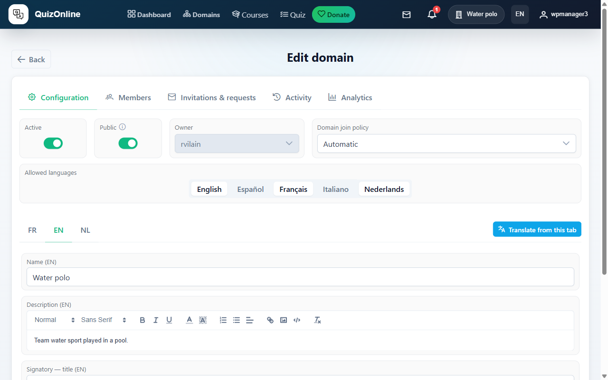
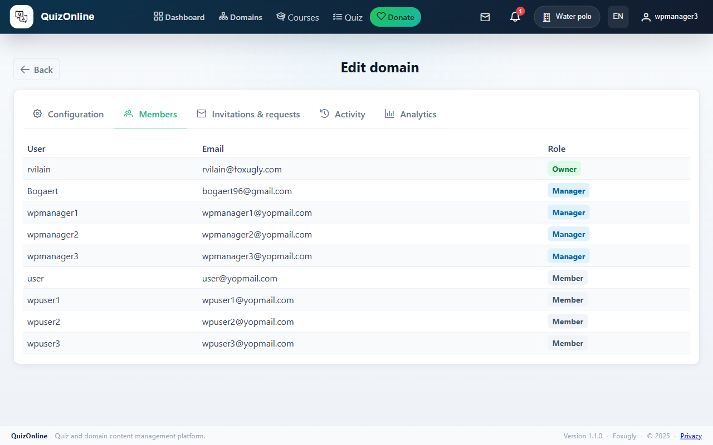
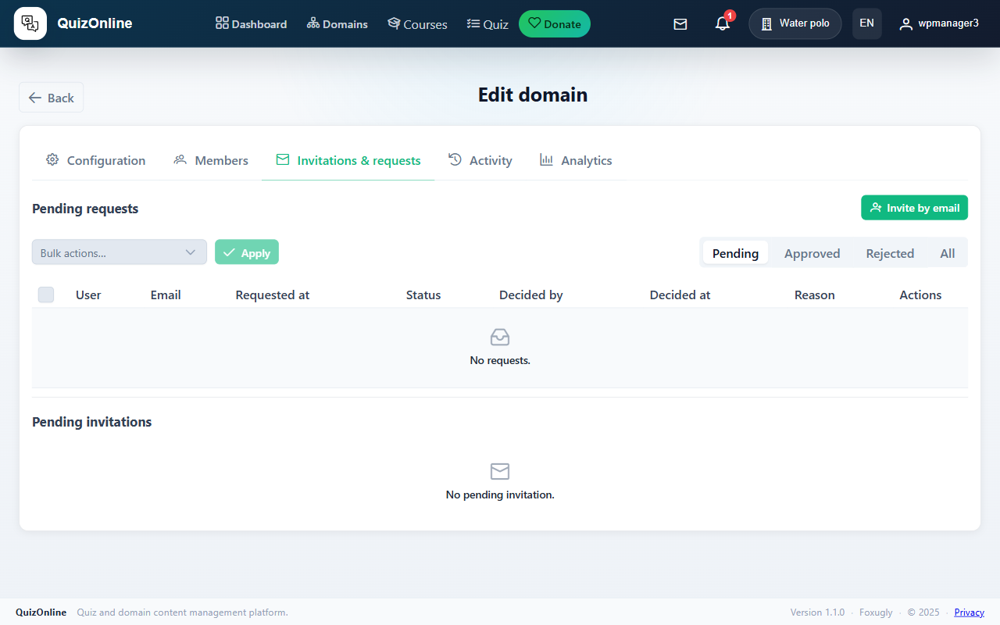
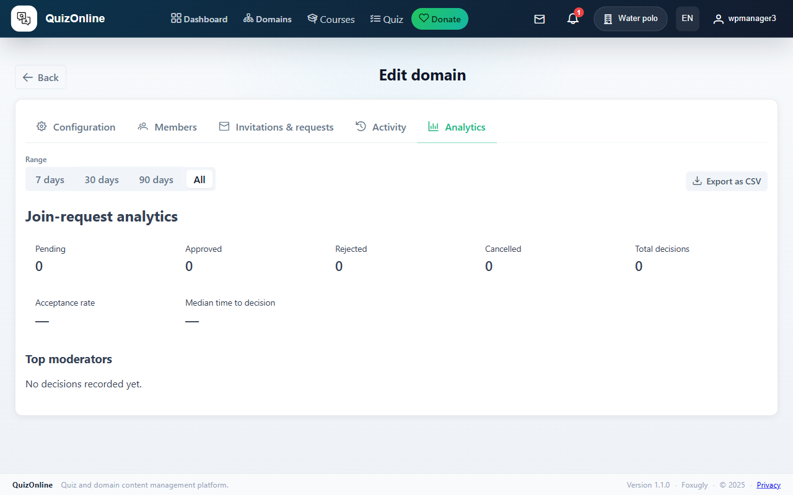
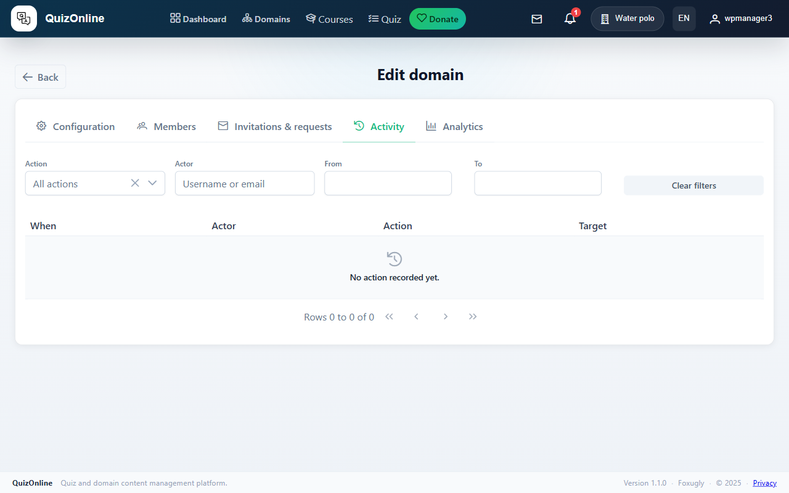
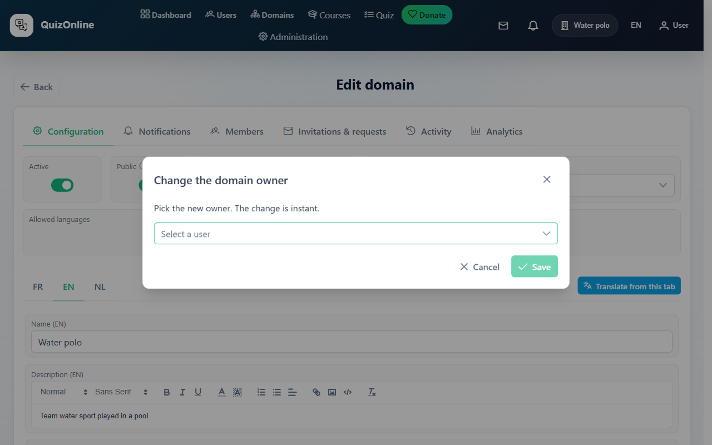
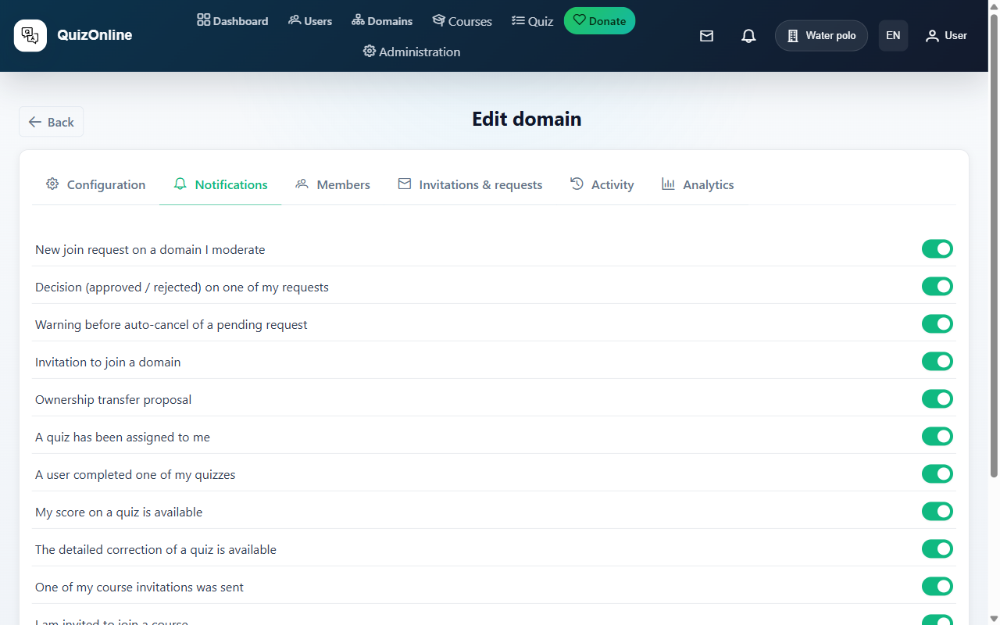

# Manual — Domain Admin

You are the **owner** of a domain. This manual covers managing the domain itself: members, managers, languages, audit, ownership transfer, notifications.

> Back to [index](index.md). See also the [learner](learner.md) and [instructor](instructor.md) manuals — an admin is also an instructor and a learner.

## Table of contents

1. [What is a domain](#1-what-is-a-domain)
2. [Configure the domain](#2-configure-the-domain)
3. [Manage managers](#3-manage-managers)
4. [Manage members](#4-manage-members)
5. [Join requests](#5-join-requests)
6. [Invite users](#6-invite-users)
7. [Domain analytics](#7-domain-analytics)
8. [The audit log](#8-the-audit-log)
9. [Transfer ownership](#9-transfer-ownership)
10. [Domain notification preferences](#10-domain-notification-preferences)

---

## 1. What is a domain

A **domain** is the platform's primary isolation unit. Everything created (courses, quizzes, topics, questions) belongs to a domain. Rights are scoped to the domain: a manager of one domain cannot do anything in another.

Three roles inside a domain:

- **Owner** — exactly one. Full control: add managers, transfer ownership, delete the domain.
- **Manager** — multiple possible. Same rights as the owner except: cannot transfer ownership and cannot delete the domain.
- **Member** — learner. Sees the domain's published courses and can enroll according to allowed modes.

## 2. Configure the domain

Page `/domain/<id>/edit`. Several tabs:

- **Configuration** — name, description, allowed languages, image (multilingual via language tabs), certificate branding (logo + signatory).
- **Notifications** — domain-level notification preferences (see section 10). *Owner-only; managers do not see this tab.*
- **Members** — manage members + managers.
- **Invitations & requests** — pending email invitations and join requests, with bulk approve/decline/revoke.
- **Activity** — action history (audit log).
- **Analytics** — KPIs.



### Allowed languages

The languages you enable here determine the languages in which courses can be created and translated. Unchecking a language after it has been used for translations does not delete existing translations — they simply become non-editable until reactivated.

Choices: French, English, Dutch, Italian, Spanish.

## 3. Manage managers

"Members" tab of the domain edit page. Managers have a dedicated section at the top. Add or remove via the auto-complete picker.



A manager becomes an instructor in your domain: they can create, edit, publish courses, invite learners, etc. (see the [instructor manual](instructor.md)).

## 4. Manage members

In the same "Members" tab, the members table shows for each: username, email, join date, last activity, actions.

Per-row actions:

- **Remove** — excludes the member from the domain. Their course enrollments remain (cancelled status).

Bulk actions (checkbox selection):

- **Bulk remove** — confirmation required.

## 5. Join requests

"Invitations & requests" tab. Lists all pending join requests with:

- Requester username and email.
- Message (if any).
- Request date.
- "Approve" / "Decline" buttons.


### Bulk approve / decline

Select several rows via checkboxes, then "Approve all" or "Decline all" above the table. Single network request, single audit log entry.

### Automatic expiration

Undecided requests expire automatically after 30 days. A warning is sent to the requester 3 days before.

## 6. Invite users

Same "Invitations & requests" tab. To pre-invite someone (by email) before they sign up — useful for users who do not yet exist.



### Invite

Enter a list of emails (one per line). On send:

- Each email receives an invitation link valid 14 days.
- If you manage several domains, you can check "Also invite to these domains" to fan out the same email list to several domains in a single request.
- The operation counts as a single hit in the `domain_invite_fanout` throttle.

### Resend / revoke

Each sent invitation appears in the table with send date, expiration, status (pending / accepted / revoked / expired). "Resend" and "Revoke" buttons per row.

## 7. Domain analytics

"Analytics" tab of the edit page.



KPIs:

- Counters: members, managers, pending requests.
- Acceptance rate of join requests.
- Median decision time (hours).
- Top 5 moderators (who approves/declines the most).

30-day sparkline on approvals / declines.

## 8. The audit log

"Activity" tab of the edit page. Lists the last 200 actions on the domain, sorted from most recent to oldest.



Audited actions: add/remove member, approve/decline request, send/revoke invitation, transfer ownership, change allowed languages, etc.

Each row carries: timestamp, actor, action, metadata (raw JSON, expandable on click).

## 9. Transfer ownership

The owner can transfer the domain to another user (a domain member, or even an external user via email). Irreversible action — be sure.

"Transfer ownership" button in the "Configuration" tab. Enter the recipient's email.



The recipient receives an email with a signed link to `/transfer/accept/<token>`. As long as they have not clicked and confirmed, **you remain owner**. On acceptance:

- The recipient becomes owner.
- You become manager (you keep instructor rights).
- An audit log entry is created.

The token expires in 7 days. If the recipient does not act, resend.

## 10. Domain notification preferences

"Notifications" tab of the edit page. **Owner-only** — managers do not see this tab.

This is a **global kill-switch per category**, not an email-vs-bell toggle like in the user-side `/preferences`. Each row carries a single ON/OFF switch: if you flip it to OFF, **no** domain recipient receives this notification anymore, regardless of their personal preferences.

### The 13 covered categories

**Domain:**

- Join request received
- Decision (approved / declined) on a request
- Warning before pending request expiration
- Invitation to join a domain
- Ownership transfer received

**Quiz:**

- A quiz has just been assigned
- An assigned quiz is completed
- My score is available
- The detailed correction is available

**LMS (courses):**

- Course invitation sent
- Course invitation received
- Course invitation accepted
- Course enrollment request created

### The intersection rule

A notification is sent **only if both opt-ins are ON**:

```
notification sent  ⇔  user-pref ON  AND  domain-pref ON
```

So:

- If you turn off `Invitation to join a domain` here → **no one** in the domain receives this notification anymore, even users who enabled it individually.
- If a user turns it off in `/preferences` → **only that user** stops receiving it; others are unchanged.

Convenient for domains that want to keep noise to a minimum (e.g. a "production" domain that only wants critical alerts).


