# Manual — Instructor

You are a manager of a domain. You can create courses, structure their content, invite learners, monitor enrollments, and publish.

> Back to [index](index.md). See also the [learner manual](learner.md) — an instructor is also a learner.

## Table of contents

1. [Prerequisite: being an instructor](#1-prerequisite-being-an-instructor)
2. [Create a course](#2-create-a-course)
3. [Structure the course](#3-structure-the-course)
4. [The 8 block types](#4-the-8-block-types)
5. [Manage enrollments](#5-manage-enrollments)
6. [Invite learners](#6-invite-learners)
7. [Publish or unpublish](#7-publish-or-unpublish)
8. [Clone, export, delete](#8-clone-export-delete)
9. [Course analytics](#9-course-analytics)
10. [Admin view: the course list](#10-admin-view-the-course-list)
11. [The question bank: topics](#11-the-question-bank-topics)
12. [Create and import questions](#12-create-and-import-questions)
13. [Compose a quiz template](#13-compose-a-quiz-template)
14. [Monitor template results](#14-monitor-template-results)

---

## 1. Prerequisite: being an instructor

You are an instructor if you are **owner** or **manager** of a domain. The domain admin added you to the managers list (see the [admin manual](admin.md#3-manage-managers)).

Instructor actions are visible on the following pages:

- "Create a course" button in the top right of `/catalog`.
- "List" button in the top right of `/catalog`, leading to `/course/list`.
- Small pencil in the top right of each course card in `/catalog` for courses you manage.
- "Published" / "Draft" tag on each card and on `/course/<slug>` when you have manage rights.

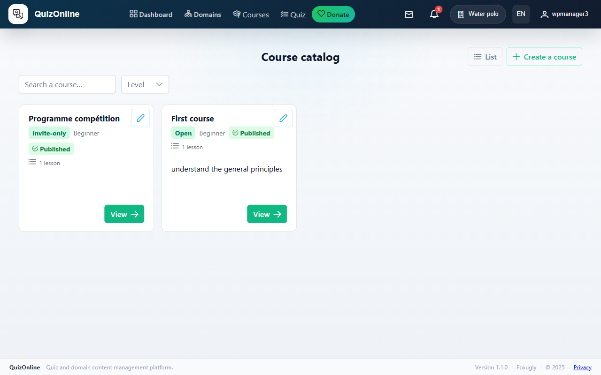

## 2. Create a course

From the catalog, click "Create a course" in the top right. You land on `/course/new`:

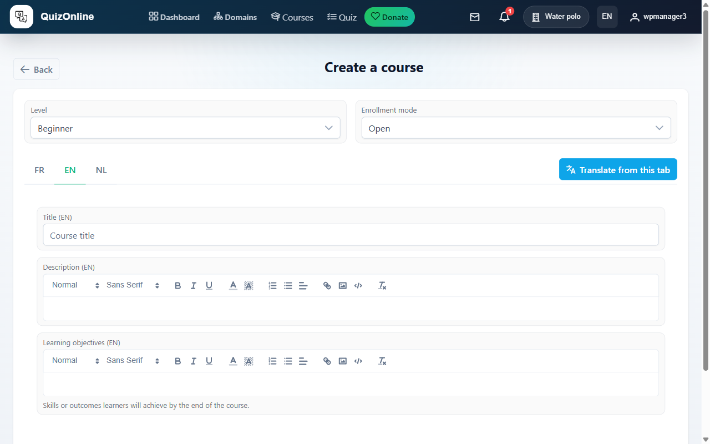

The **domain** of the course is the one currently active in the top bar (the badge to the right of the navigation tabs — "Water-polo" in the screenshot). To create a course in another domain, switch to it first from the domains list. The **languages** available as tabs are the `allowed_languages` of that domain, and the first one in that list becomes the course's primary language.

Form fields:

- **Level** — Beginner / Intermediate / Advanced.
- **Enrollment mode**:
  - **Free**: any domain member can enroll in one click.
  - **On approval**: enrollments go pending, to be approved one by one in the "Enrollments" tab.
  - **On invitation**: the course is invisible in the catalog to members without a pending invitation.
- **Title**, **Description**, **Learning objectives** — one tab per allowed language. The "Translate from this tab" button fills empty fields in the other languages from the active tab's content (handy to seed a translation).

The **slug** is generated server-side from the title and **frozen after creation** (URL stability takes precedence over cosmetics) — that's why it does not appear in the form.

After creation, you land on `/course/<id>/edit`, the editing shell.

## 3. Structure the course

The edit page has 4 tabs:

- **Information** — metadata (title, description, objectives, estimated duration, cover image). Multilingual via language tabs.
- **Structure** — sections + lessons + blocks. Drag-and-drop to reorder.
- **Enrollments** — who is enrolled, who is waiting, ongoing invitations.
- **Analytics** — KPIs and 30-day sparkline.

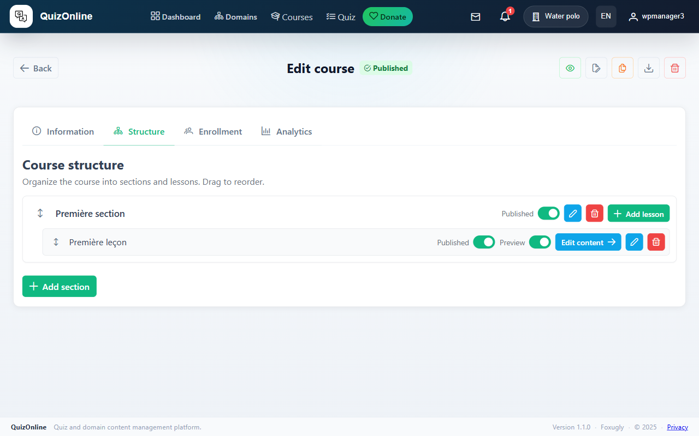

### Hierarchy

```
Course
└── Section 1
    ├── Lesson 1.1
    │   ├── Rich text block
    │   ├── Video block
    │   └── Quiz block
    └── Lesson 1.2
└── Section 2
    └── ...
```

### Reorder

Each level (sections, lessons, blocks) supports drag-and-drop. The handle is on the left of the item. Order is persisted immediately.

### Per-language editing

Each lesson, section, and translatable block (title, description, rich-text content) is editable per language via tabs at the top of the block editor. A "Translate from current tab" button fills empty fields in another language by copying the active language's content (useful to bootstrap a translation).

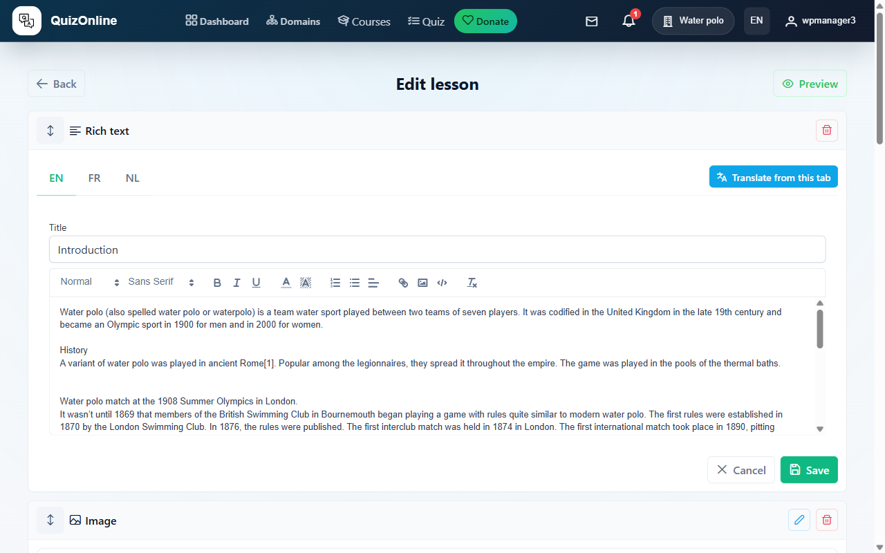

### Learner preview

An eye button in the lesson editor opens the learner-side preview (read-only, in the edit context) so you can check the rendering.

## 4. The 8 block types

The lesson editor (`/lesson/<id>/edit`) offers 8 block types. Click "Add a block" to open the picker:

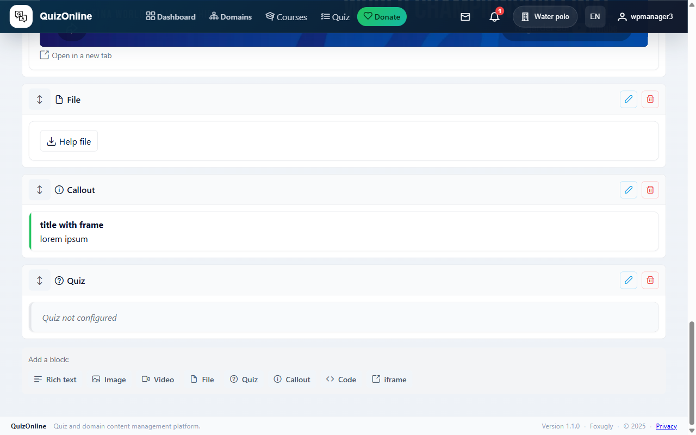

| Type | Usage | Notes |
|------|-------|-------|
| **Rich text** | Formatted paragraphs, lists, quotes, inline code | Quill editor — colors, alignments, etc. HTML sanitized server-side. |
| **Image** | Illustration | Upload via PrimeNG fileupload. No automatic resizing. |
| **Video** | YouTube / Vimeo / upload | URL auto-detected. The render is a live iframe in the editor. |
| **File** | PDF, slides, doc | Learners see a download link. |
| **Quiz** | Embedded quiz | Auto-complete picker over the parent course's domain `QuizTemplate`s, configurable minimum score. |
| **Callout** | Note, warning, tip | Configurable color. |
| **Code** | Snippet | Syntax highlighting per language. |
| **Embed** | External iframe | Use sparingly (third-party cookies, GDPR). |

### Auto-save

Every block edit is saved automatically via debounced PATCH (1 s inactivity). A "Saved" indicator appears at the bottom of the block.

## 5. Manage enrollments

"Enrollments" tab of `/course/<id>/edit`.

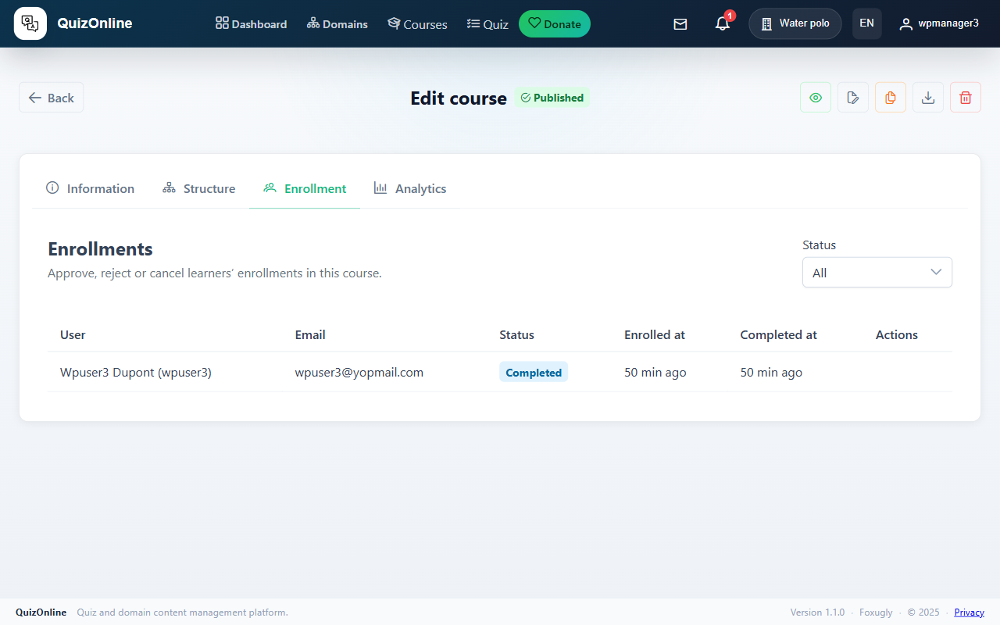

### For a course on approval

Enrollments arrive with **Pending** status. Per-row buttons:

- **Approve** — the learner joins the course and receives a confirmation email.
- **Decline** — the request is rejected and the learner receives an explanation email.

Filter at the top to see only pending or all history.

### For a course on invitation

An additional "Invite a learner" section appears at the top, with an auto-complete picker + a "Send" button. See next section.

## 6. Invite learners

In the "Enrollments" tab of an invitation-mode course.

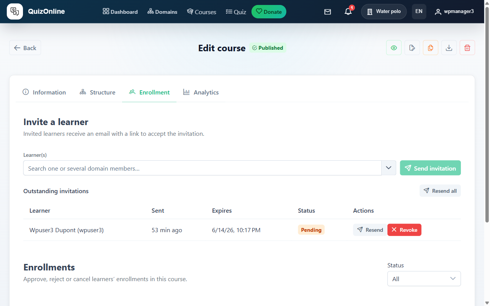

### Invite one or more members

1. Type 2+ characters in the picker. Domain members appear (those already enrolled or already invited are filtered out).
2. Select one or several members (multi-select). The "Send X invitations" button adapts.
3. Click. All invitations go out in one network request and count as a single hit in the `lms_invite_send` throttle bucket (50/min by default).

Recipients receive an email with a unique link to `/course-invite/<token>`. The link expires in 14 days. An automatic reminder is sent 3 days before expiration if they have not accepted.

### List of pending invitations

Below the invitation form, a table lists all pending invitations for this course:

- **Learner** + **Sent** + **Expires** + **Status** + actions.
- **Resend** per row — pushes `expires_at` to +14 days and resets the D-3 reminder.
- **Revoke** per row — cancels the invitation; the learner can no longer accept it.

### Resend all

If you have many pending invitations (a cohort that starts late, for example), a "Resend all" button above the table resends them all in one click. A row is added to the audit log with `processed` and `skipped`.

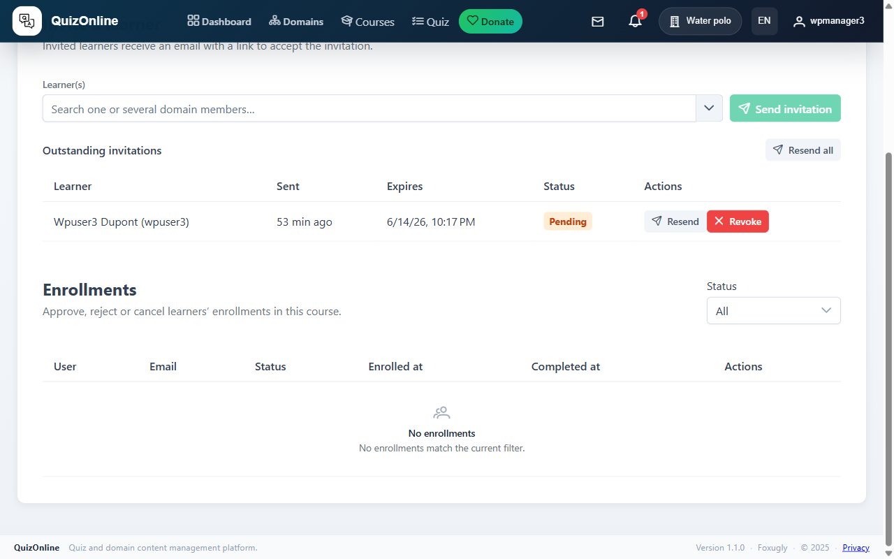

## 7. Publish or unpublish

A **draft** course is invisible to non-instructors in the catalog. To make it visible: eye button ("Publish") in the top right of the edit page.

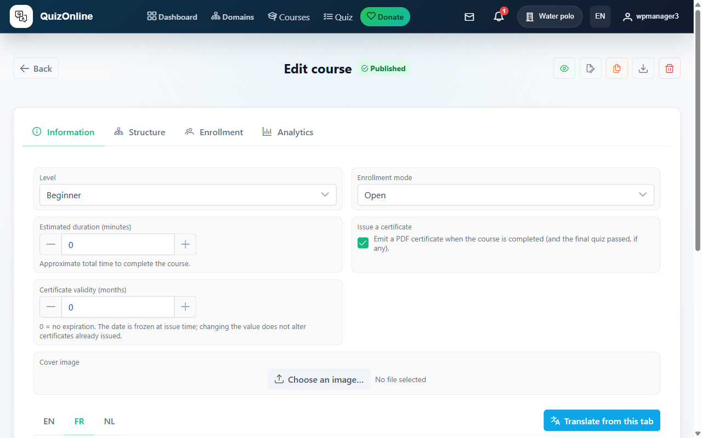

The course must have at least one published section with at least one published lesson to be publishable — otherwise the server returns an explicit error.

Once published, the icon flips to "crossed-out eye" ("Unpublish"). Unpublishing does not delete anything: existing enrollments remain, but the course becomes invisible to new learners.

A centered "Draft" tag below the header reminds the state until published (also visible on the detail page and on catalog cards for instructors).

## 8. Clone, export, delete

Three buttons to the right of the edit page header:

- **Duplicate** — creates a full copy (sections + lessons + blocks) in draft mode. Useful to start a new course from an existing template.
- **Export (JSON)** — downloads the course as portable JSON. The payload is re-importable via an API endpoint.
- **Delete** — permanently deletes the course, its sections, lessons, blocks, **and all learner enrollments**. ⚠️ If the course has already issued certificates, deletion is blocked (certificates are protected cascade-wise).


## 9. Course analytics

"Analytics" tab of `/course/<id>/edit`.

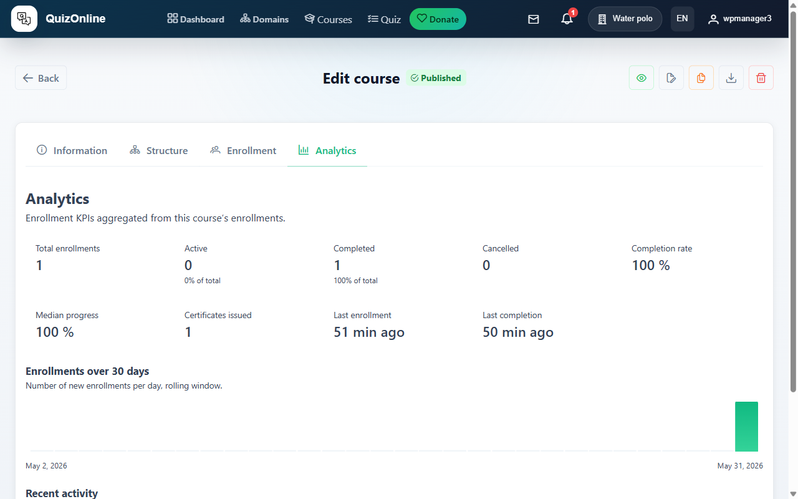

Surfaced KPIs:

- **Total enrollments** + breakdown active / pending / cancelled.
- **Completion rate** — % of enrollees who finished.
- **Median progress** — where the median learner stands.
- **Certificates issued**.
- **30-day sparkline** — new enrollments per day.

For invitation-mode courses, a sub-section adds:

- Invitations sent, accepted, declined, expired.
- Acceptance rate.
- Median acceptance time.

## 10. Admin view: the course list

`/course/list` ("List" button in the top right of the catalog) — an admin table of all the courses you manage, drafts included.

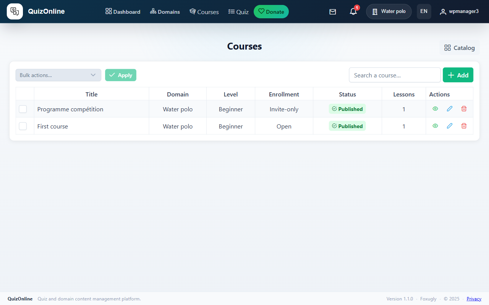

Columns: Title, Domain, Level, Enrollment mode, Status (Published / Draft), Number of lessons, Actions.

Per-row actions:

- Eye — open the detail page.
- Pencil — edit.

Bulk actions (checkbox selection):

- **Publish** — bulk publish.
- **Unpublish** — bulk unpublish.
- **Delete** — bulk delete (confirmation required, certificates protected).

Standard paginator below the table — page size 20.

## 11. The question bank: topics

**Topics** (the EN label for what the codebase calls `Subject`) group questions by theme (chapter, target skill, etc.). Optional — a question can live without a topic — but they are what lets you filter the library in the quiz editor and the questions list.

### List topics

`/subject/list` — table with free-text search and bulk actions (activate / deactivate / delete). Columns: name, active, domain, number of linked questions.

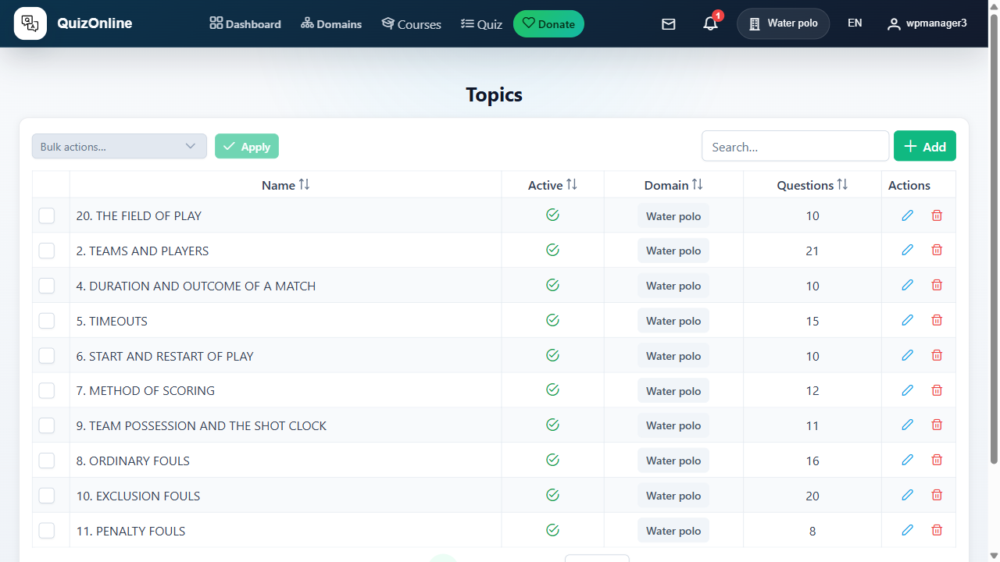

### Create a topic

"+ Add" button in the top right → `/subject/add`. Fields: **name**, **active** (yes/no), **domain** (pre-filled if you only manage one, picker otherwise).

### Edit or delete

Pencil per row — edits name, domain, active flag. Trash — deletes; linked questions are detached, not deleted.

## 12. Create and import questions

`/question/list` — the question bank for every domain you manage. Filters:

- **Free-text search** on the title.
- **Topics** — multi-select. Only shows questions that have at least one of the selected topics.

Columns: title, active, modes (Practice / Exam / both), topics, actions. Bulk actions: activate / deactivate / delete.

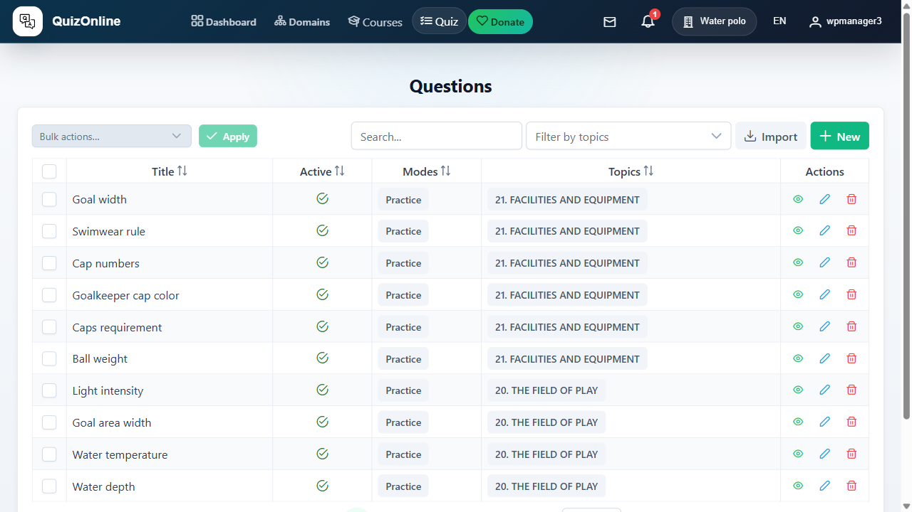

### Create a question

"New question" button at the top → `/question/add`. The form has two parts:

1. **Metadata**: active, domain, topics (multi-select), modes (check Practice and/or Exam).
2. **Content per language**: one tab per allowed language of the domain. You edit the statement then the answer options through the same 8 block types as a lesson (see [chapter 4](#4-the-8-block-types)). "Translate from this tab" fills the empty languages.

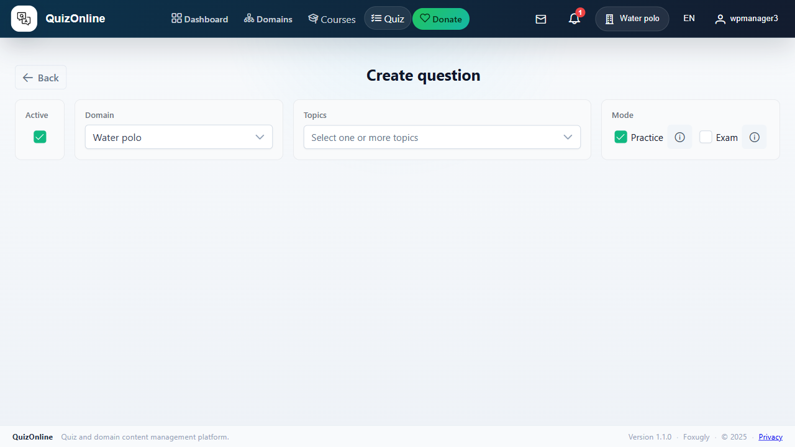

Auto-saved while you edit.

### Practice vs Exam modes

- **Practice** — the question can be used in a practice-mode quiz. Feedback appears immediately after each answer; the learner can retry.
- **Exam** — the question can be used in an exam-mode quiz. The score is revealed at the end only, and each exam template is **single-attempt** per learner.

A question can be flagged Practice **and** Exam — that's actually the default.

### Bulk import

"Import" button next to "New question" → `/question/import`. Uploads a file to create many questions at once — handy for migrating an existing bank.

## 13. Compose a quiz template

`/quiz/list` — the entry point. Two tabs:

- **Templates** — the list of `QuizTemplate`s in the domains you manage. "Compose" (full form) and "Quick create" buttons in the top right.
- **My sessions** — your own `Quiz` instances (in-progress or completed sessions, including as an instructor).

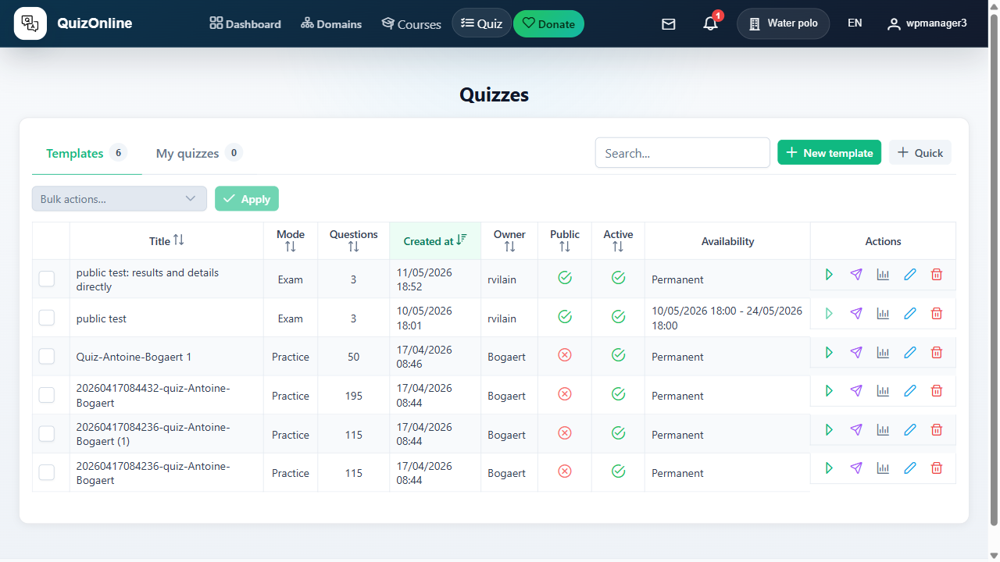

### The editor (`/quiz/add`)

Three tabs:

#### "Texts" tab

Title + description per language (one tab per allowed language), with the "Translate from this tab" button.

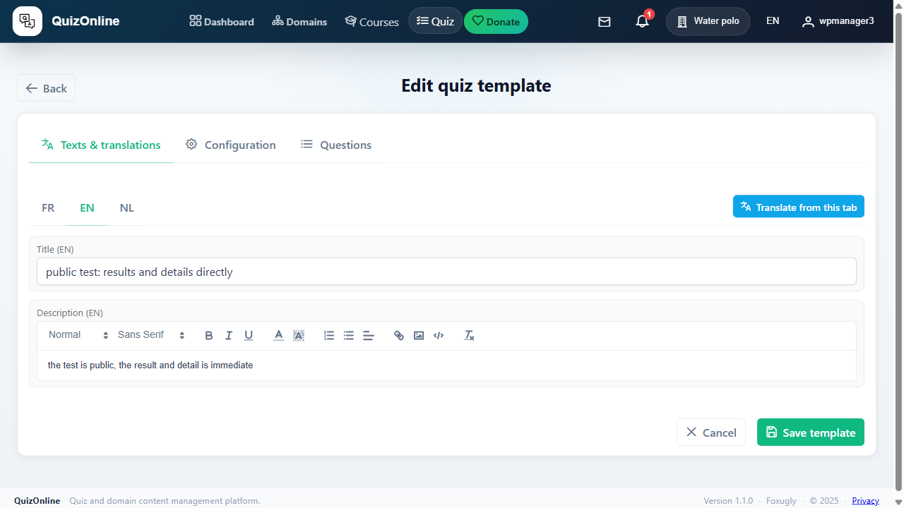

#### "Configuration" tab

Six configuration sections:

- **Status** — Active (usable) / Public (visible in the catalog to every domain user; otherwise visible only to learners that the instructor has explicitly assigned a session to).
- **Mode** — Practice / Exam. **Timer**: on/off, duration in minutes. On expiry, the session is auto-submitted.
- **Order** — "Shuffle questions": otherwise the order is the one from the Questions tab.
- **Availability** — **Permanent** (always open) **or** a window with "Starts at" / "Ends at". Outside the window the quiz is invisible in the catalog.
- **Result visibility** — Immediate (on submit) / Scheduled (from a chosen date) / Never.
- **Detail visibility** (questions + correct answers) — Immediate / Scheduled / Never. Independent from result visibility.

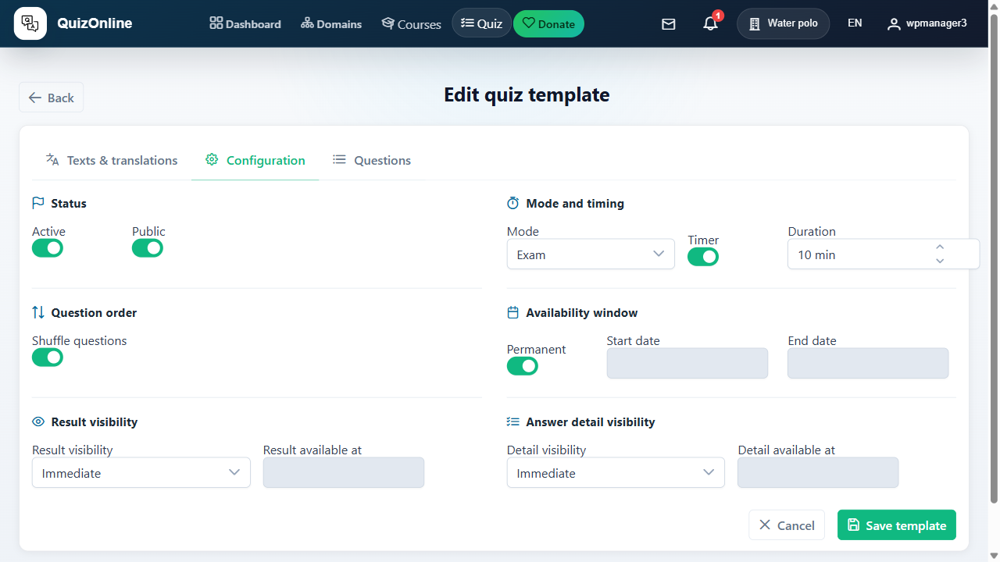

#### "Questions" tab

Two columns:

- **Library** (left) — free-text search + topic filter. "+" button on each card to add to the composition. A "+ Create" button opens the question editor in a dialog without leaving the quiz.
- **Composition** (right) — your questions in order. Up/down buttons to reorder, cross to remove, weight field to weight (the score is computed weighted).

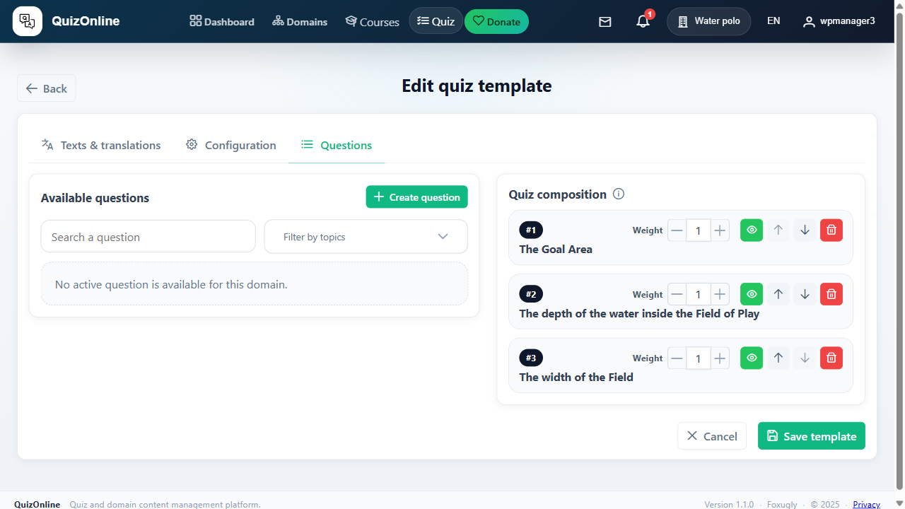

Auto-saved with a "Saved X ago" indicator at the bottom of the form.

### Quick create

For a simple mono-language quiz, the "Quick create" button in `/quiz/list` opens `/quiz/quick`, a lightweight form: title + question selection. The quiz is created with defaults (active, non-public, practice, no timer, permanent).

## 14. Monitor template results

From the templates list in `/quiz/list`, the "Results" action takes you to `/quiz/template/<templateId>/results`: the list of every session (`Quiz`) launched on this template, by any learner in the domain.

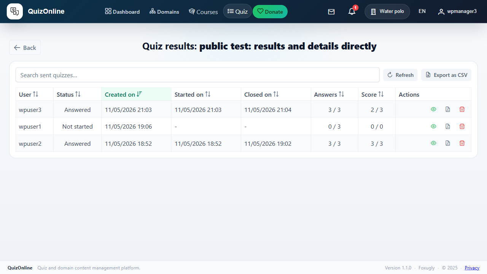

Columns: learner, start date, end date, score, state. Use it to monitor the cohort of a quiz used in a course, or spot a systematically failed question.
