# Manual — Learner

You are a member of a domain and want to take courses. This manual covers everything you need from first login to certificate.

> Back to [index](index.md).

## Table of contents

1. [Sign in and dashboard](#1-sign-in-and-dashboard)
2. [The course catalog](#2-the-course-catalog)
3. [Enroll in a course](#3-enroll-in-a-course)
4. [Take a lesson](#4-take-a-lesson)
5. [Take a quiz](#5-take-a-quiz)
6. [Track my progress](#6-track-my-progress)
7. [My certificates](#7-my-certificates)
8. [Manage my invitations](#8-manage-my-invitations)
9. [Personal preferences](#9-personal-preferences)

---

## 1. Sign in and dashboard

### Sign in

Two ways to reach the platform:

- **Classic password** from `/login`: username + password.
- **Magic link** from `/login`: enter your email and click "Sign in with a magic link". You receive an email with a single-use link valid for a few minutes. Convenient if you forgot your password and want to skip the reset flow.

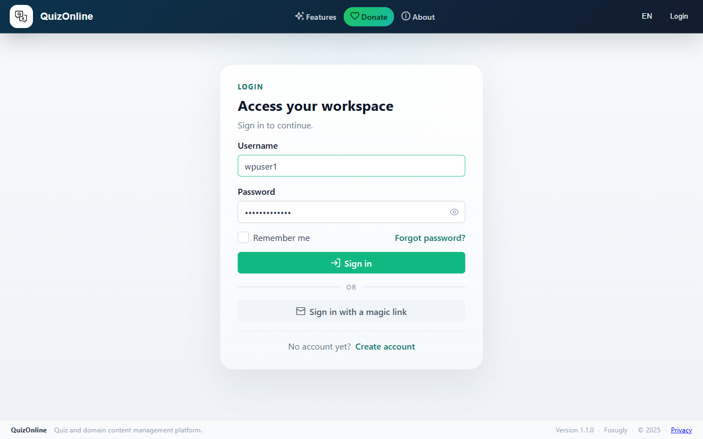

### The dashboard

After sign-in you land on `/dashboard`. It is your starting point and aggregates everything that concerns you in a grid of tiles:

- **My courses in progress** — your 3 most recently active courses with their progress bar.
- **My certificates** — counter of certificates earned + link to the full list.
- **My quizzes** — shortcut to your quiz sessions.
- **Pending invitations** — your course invitations (only shown if you have at least one invitation, or if you are an instructor yourself).
- **Catalog** — shortcut to the course catalog.

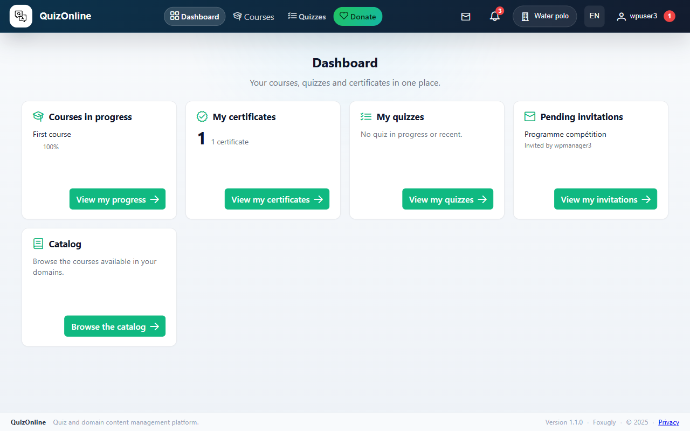

## 2. The course catalog

The catalog (`/catalog`) lists all **published** courses visible to you across your domains.

### Filters

Three filters at the top:

- **Search** — free text, searches titles and descriptions. Debounced 300 ms — no need to press Enter.
- **Level** — Beginner / Intermediate / Advanced.
- **Domain** — only shown if you belong to several domains.

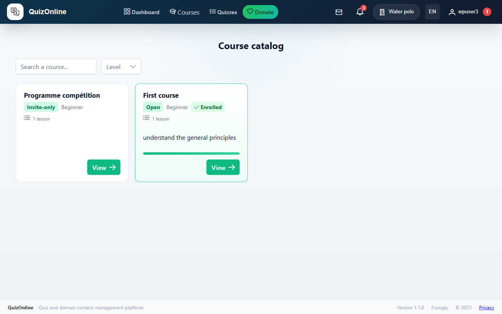

### Reading a course card

Each card shows the title, an enrollment-mode badge (Free / On approval / On invitation), the level, the number of lessons, the estimated duration, and the description truncated to 3 lines. If you are already enrolled, a green "Enrolled" badge appears and the progress bar partially replaces the card content.

Click "View" (or "Resume" if you are already enrolled with an unfinished lesson) to open the detail page.

### Pagination

Below the grid, a paginator lets you navigate if your domain has more than 20 courses.

## 3. Enroll in a course

The detail page (`/course/<slug>`) shows the title, description, learning objectives (if filled in), and the tree of sections + lessons.

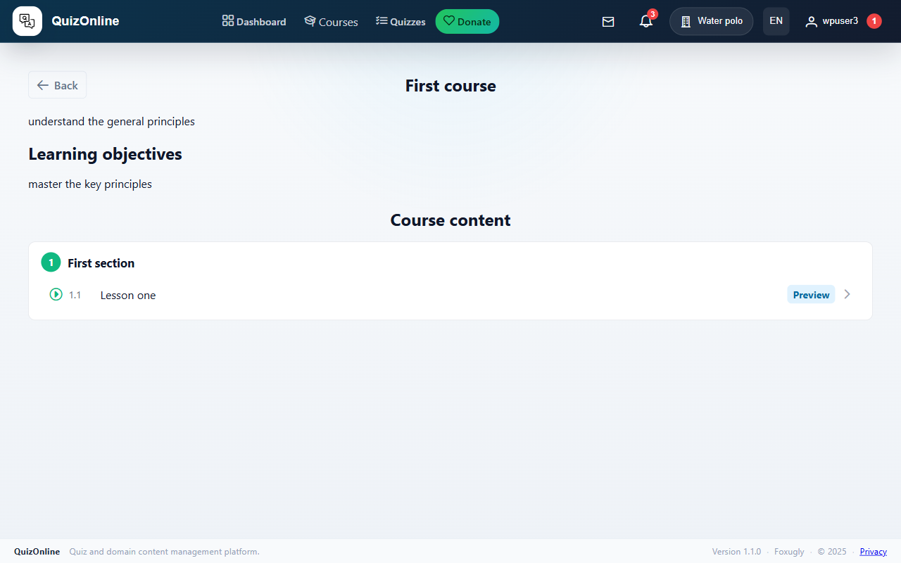

The button on the right of the header depends on the course's enrollment mode and your status:

| Mode | You are not enrolled | You are enrolled |
|------|----------------------|------------------|
| Free | "Enroll" — single click, you are enrolled. | "Resume" — takes you to the next unfinished lesson. |
| On approval | "Enroll" — your request goes pending, an instructor has to approve. | Same. |
| On invitation | The course is hidden until you receive an invitation. Otherwise: "Accept invitation". | Same. |

### Invitation-based enrollment

If you received an invitation by email:

1. Click the link in the email — you land on `/course-invite/<token>`.
2. An acceptance page shows the course, who invited you, and the expiration date.
3. Click "Accept invitation" to enroll and join the course.

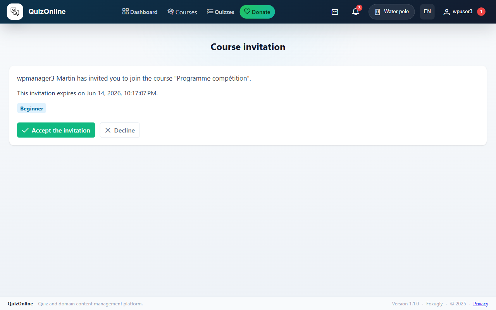

The invitation automatically expires 14 days after it was sent. You receive an email reminder 3 days before expiration if you have not yet accepted.

## 4. Take a lesson

The lesson page (`/lesson/<id>`) is split into:

- **Block outline** (left, sticky on desktop) — numbered list of the lesson's content blocks, with scroll-spy: the visible block is highlighted in the outline.
- **Lesson body** (right) — the real content, one block per card.
- **Private notes** (bottom) — a text field for personal notes, automatically saved (debounced 600 ms).
- **Navigation footer** — "← Previous lesson", "Mark as completed", "Next lesson →" buttons.

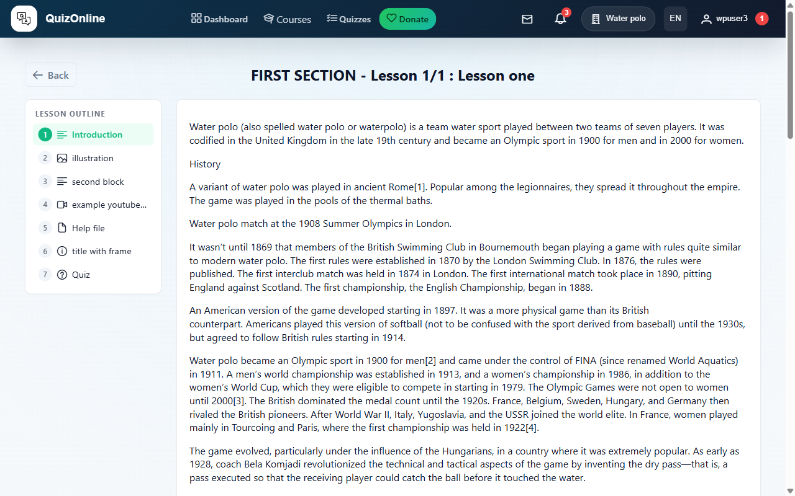

### Block types

A lesson can contain 8 block types:

- **Rich text** — formatted paragraphs.
- **Image** — illustrations.
- **Video** — YouTube, Vimeo, or uploaded file.
- **File** — PDF or document to download.
- **Quiz** — an embedded quiz (see next section).
- **Callout** — highlighted note or warning.
- **Code** — code snippet with syntax highlighting.
- **Embed** — external content via iframe.

### Mark a lesson as completed

The "Mark as completed" button in the center of the footer records completion. The "Next lesson" button has a small pulse effect right after to nudge you forward. Course progress updates automatically.

## 5. Take a quiz

If a lesson contains a Quiz block, you see a card with a "Start the quiz" button. If you have already passed the quiz, the card shows your score.

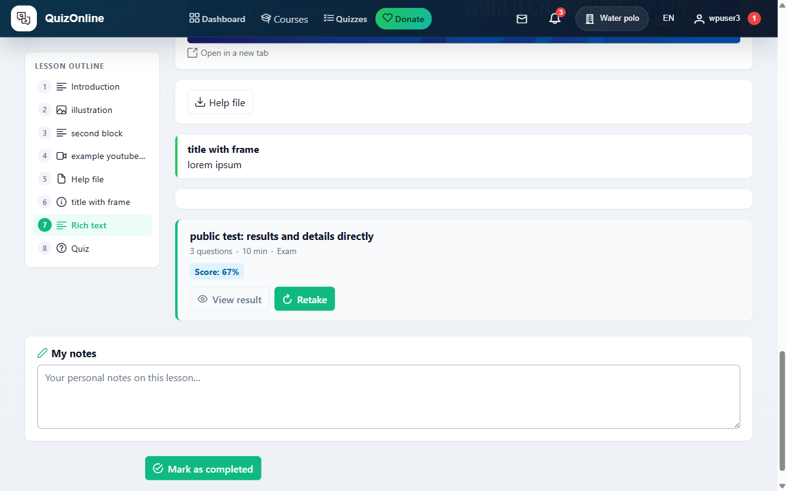

A second entry point is `/quiz/list`, "Templates" tab: the list of every public quiz in the domains you belong to, with a "Start" button per card. The "My sessions" tab lists sessions you have already created (in-progress or completed) so you can resume or check the score.

### The player UI

The player page (`/quiz/<quizId>/questions`) is split in two columns:

**Left column**

- **Countdown** if the quiz has a timer. On zero, the session is auto-submitted.
- **Navigation grid** — one button per question, in a 5-column grid. Each button shows its state:
  - empty — not seen yet;
  - answered — you ticked at least one option;
  - flagged for review (flag icon) — you want to come back.

Click a number to jump straight to that question.

**Right column** — the current question:

- Statement (possibly with images, video, code, etc. — same block palette as a lesson).
- Answer options to tick (radio when one correct answer, checkbox when several).
- **Flag for review** button — toggles the flag so you can come back before submitting.
- **Report an issue** button — sends an alert to the instructor (typo, wrong answer, ambiguity). Opens a dialog to describe the issue.
- **Previous** / **Next** / **Finish** buttons (Finish appears on the last question).

### Practice vs Exam

- **Practice** — the correction appears immediately after each "Next". You see your mistakes and can retry on a new session.
- **Exam** — no correction until you finish. **Single-attempt**: once the session is started, you cannot create another one on the same template (unless the instructor deletes your session).

### Submit and review the score

"Finish" button on the last question (confirmation required). You land on `/quiz/<quizId>`, the session recap: date, duration, score, pass/fail status.

- If **score visibility** is immediate, the score shows here. If it is scheduled, you see an "Available from…" message until the date.
- If **detail visibility** allows it, a "Review questions" button opens the grid read-only with your answers and the correct ones.

Passing a quiz with a score ≥ the threshold set by the instructor automatically marks the lesson (or the course, for a final quiz) as completed.

## 6. Track my progress

`/me/progress` lists all your active enrollments with their progress bar. Click a course to resume.

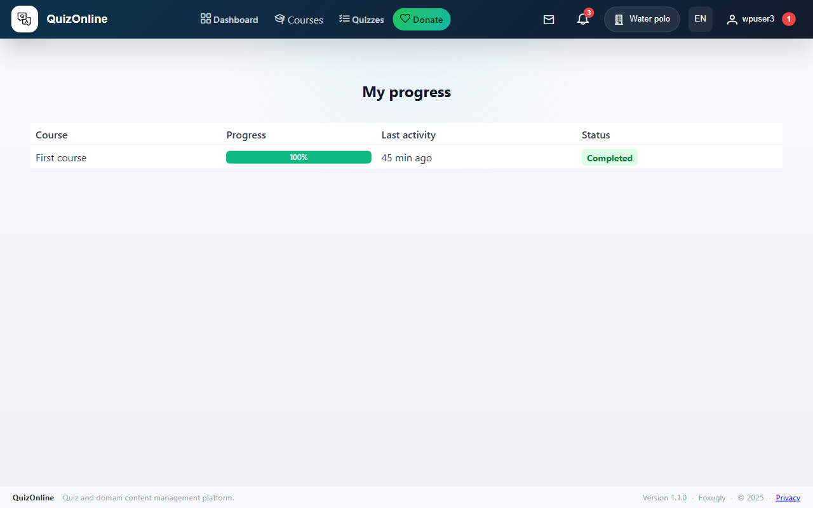

## 7. My certificates

`/me/certificates` lists the certificates you have earned. Each certificate shows the course title, issue date, certificate number, and a "Download PDF" button.

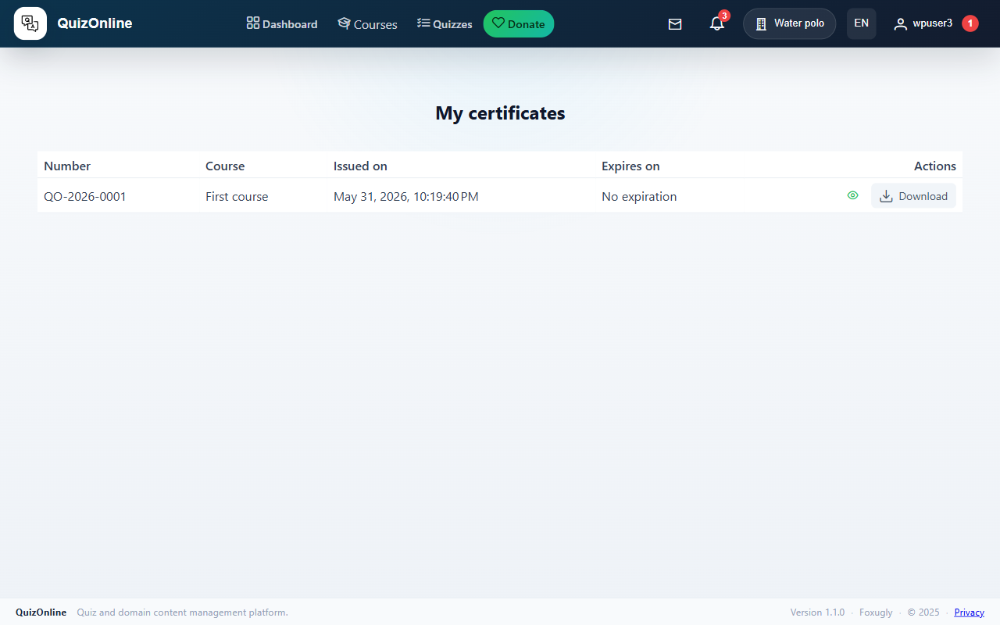

### Verify a certificate's authenticity

Each certificate carries a **public verification token** in the format `https://quizonline.foxugly.com/verify/<token>`. Anyone (even unauthenticated) can open this URL and confirm that the certificate is genuine, who earned it, and when. Convenient for sharing on a CV or LinkedIn.

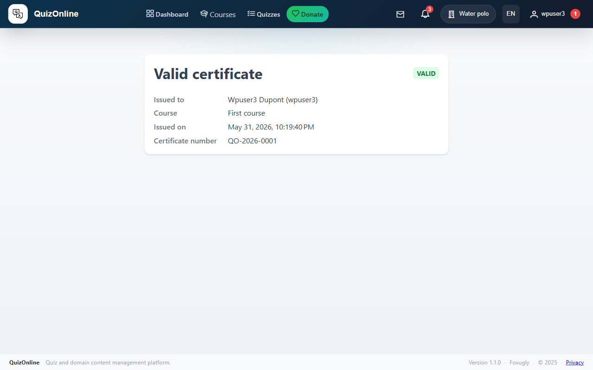

## 8. Manage my invitations

`/me/invitations` lists all your course invitations, organized in two tabs:

- **Pending** — invitations not yet accepted (and not expired). "Accept" or "Decline" button per row.
- **History** — everything else (accepted, declined, revoked, expired). If accepted, a "Go to course" button lets you return to it.

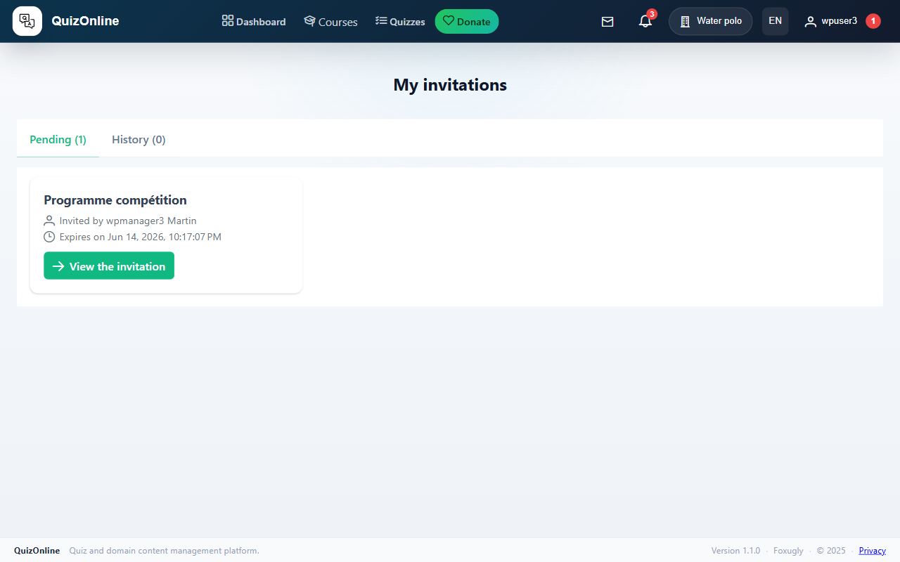

## 9. Personal preferences

`/preferences` (from the user menu in the top right): change your name, email, password, and UI language (FR / EN / NL / IT / ES).

### Notification preferences

For each event type (invitation received, enrollment approved, certificate issued, etc.) you can independently disable:

- Email (useful if you read everything in the app).
- Web notification (the bell in the top right).

Preferences are per-domain AND per-user — a notification is sent only if BOTH allow it. So if you mute the bell for invitations, you no longer receive any, regardless of what the domain does.

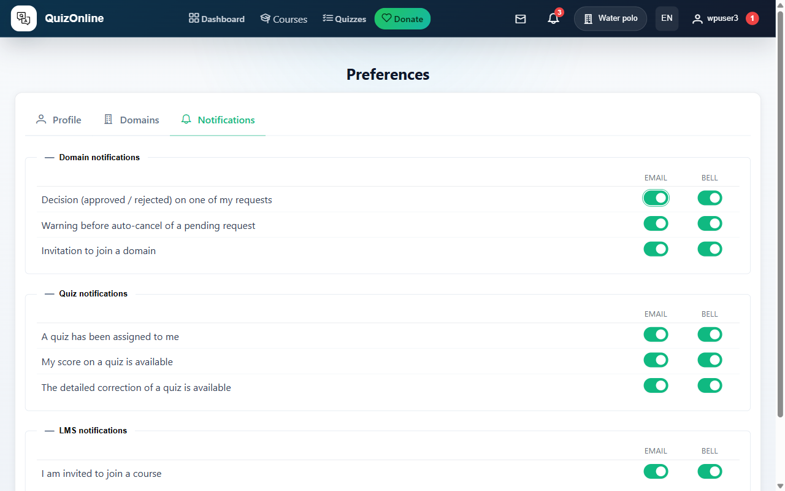
