# Manuel — Instructeur

Vous êtes manager d'un domaine. Vous pouvez créer des cours, structurer leur contenu, inviter des apprenants, suivre les inscriptions et publier.

> Retour au [sommaire](index.md). Voir aussi le [manuel apprenant](learner.md) — un instructeur est aussi un apprenant.

## Sommaire

1. [Prérequis : être instructeur](#1-prérequis--être-instructeur)
2. [Créer un cours](#2-créer-un-cours)
3. [Structurer le cours](#3-structurer-le-cours)
4. [Les 8 types de blocs](#4-les-8-types-de-blocs)
5. [Gérer les inscriptions](#5-gérer-les-inscriptions)
6. [Inviter des apprenants](#6-inviter-des-apprenants)
7. [Publier ou dépublier](#7-publier-ou-dépublier)
8. [Cloner, exporter, supprimer](#8-cloner-exporter-supprimer)
9. [Analyses du cours](#9-analyses-du-cours)
10. [Vue admin : la liste des cours](#10-vue-admin--la-liste-des-cours)
11. [La banque de questions : les sujets](#11-la-banque-de-questions--les-sujets)
12. [Créer et importer des questions](#12-créer-et-importer-des-questions)
13. [Composer un modèle de quiz](#13-composer-un-modèle-de-quiz)
14. [Suivre les résultats d'un modèle](#14-suivre-les-résultats-dun-modèle)

---

## 1. Prérequis : être instructeur

Vous êtes instructeur si vous êtes **owner** ou **manager** d'un domaine. C'est l'admin du domaine qui vous a ajouté à la liste des managers (voir le [manuel admin](admin.md#3-gérer-les-managers)).

Les actions instructeur sont visibles sur les pages suivantes :

- Bouton « Créer un cours » en haut à droite de `/catalog`.
- Bouton « Liste » en haut à droite de `/catalog`, qui mène à `/course/list`.
- Petit crayon en haut à droite de chaque card de cours dans `/catalog` pour les cours que vous gérez.
- Tag « Publié » / « Brouillon » sur chaque card et sur `/course/<slug>` quand vous pouvez gérer.

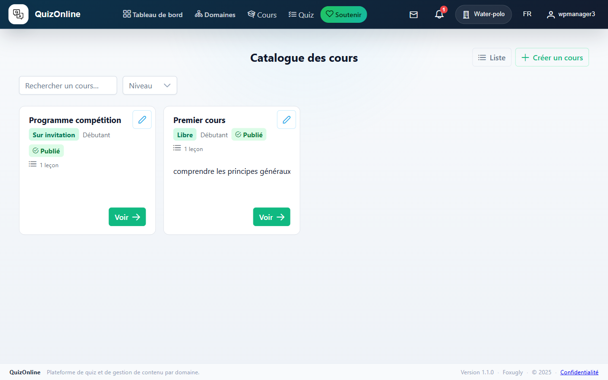

## 2. Créer un cours

Depuis le catalogue, cliquez sur « Créer un cours » en haut à droite. Vous arrivez sur `/course/new` :

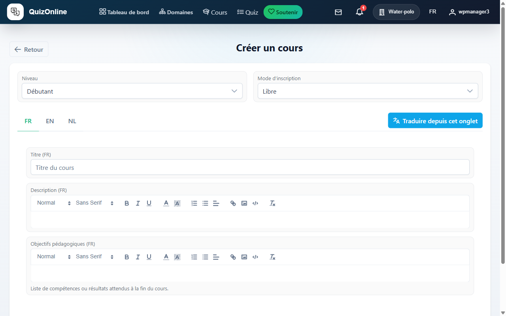

Le **domaine** du cours est celui actif dans la barre de navigation (le badge à droite des onglets — « Water-polo » dans le screenshot). Pour créer un cours dans un autre domaine, basculez-y d'abord depuis la liste des domaines. Les **langues** disponibles dans les onglets sont les `allowed_languages` de ce domaine, et la première de cette liste sera la langue principale du cours.

Champs du formulaire :

- **Niveau** — Débutant / Intermédiaire / Avancé.
- **Mode d'inscription** :
  - **Libre** : tout membre du domaine peut s'inscrire en un clic.
  - **Sur validation** : les inscriptions partent en attente, à approuver une par une dans l'onglet « Inscriptions ».
  - **Sur invitation** : le cours est invisible dans le catalogue pour les membres sans invitation pendante.
- **Titre**, **Description**, **Objectifs pédagogiques** — un onglet par langue autorisée. Le bouton « Traduire depuis cet onglet » remplit les champs vides des autres langues à partir du contenu de l'onglet actif (utile pour démarrer une traduction).

Le **slug** est généré côté serveur à partir du titre et **figé après création** (la stabilité des URLs prime sur la cosmétique) — il n'apparaît donc pas dans le formulaire.

Après création, vous arrivez sur `/course/<id>/edit`, le shell d'édition.

## 3. Structurer le cours

La page d'édition a 4 onglets :

- **Informations** — métadonnées (titre, description, objectifs, durée estimée, image de couverture). Saisie multilingue via les onglets de langue.
- **Structure** — sections + leçons + blocs. Drag-and-drop pour réordonner.
- **Inscriptions** — qui est inscrit, qui attend, invitations en cours.
- **Analyses** — KPIs et sparkline 30 jours.

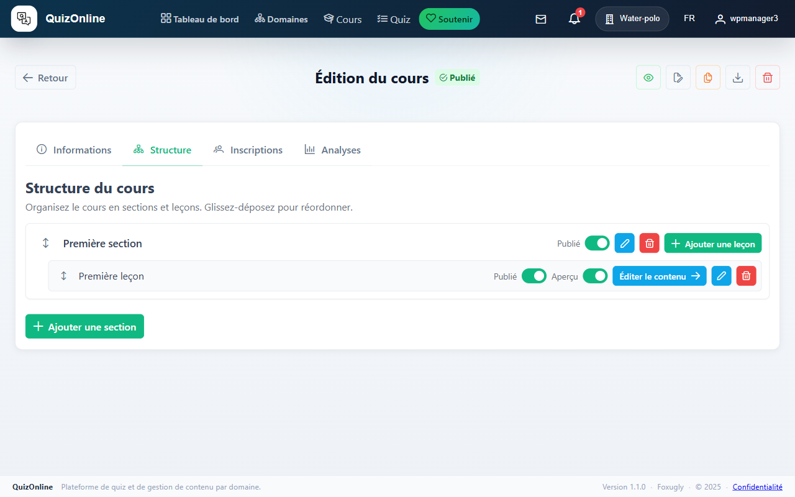

### Hiérarchie

```
Cours
└── Section 1
    ├── Leçon 1.1
    │   ├── Bloc texte enrichi
    │   ├── Bloc vidéo
    │   └── Bloc quiz
    └── Leçon 1.2
└── Section 2
    └── ...
```

### Réordonner

Chaque niveau (sections, leçons, blocs) supporte le drag-and-drop. La poignée est à gauche de l'élément. L'ordre est persisté immédiatement.

### Édition par langue

Chaque leçon, section et bloc traduit (titre, description, contenu rich-text) est éditable par langue via des onglets en haut de l'éditeur de bloc. Un bouton « Traduire depuis l'onglet courant » remplit les champs vides d'une autre langue en copiant le contenu de la langue active (utile pour démarrer une traduction).

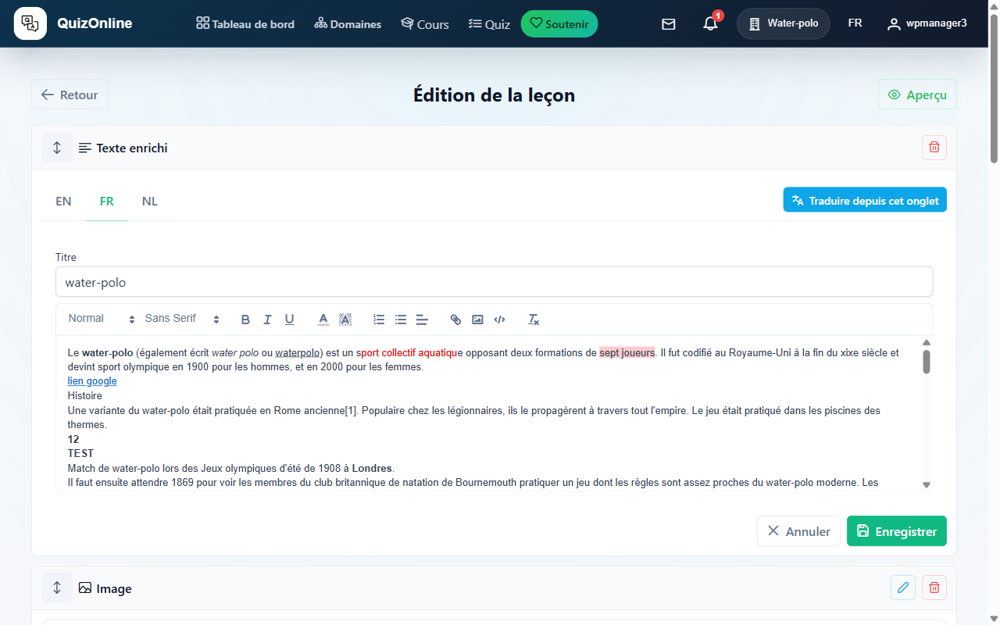

### Aperçu apprenant

Un bouton œil dans l'éditeur de leçon ouvre l'aperçu côté apprenant (lecture seule, dans le contexte d'édition) pour vérifier le rendu.

## 4. Les 8 types de blocs

L'éditeur de leçon (`/lesson/<id>/edit`) propose 8 types de blocs. Cliquez sur « Ajouter un bloc » pour ouvrir le picker :

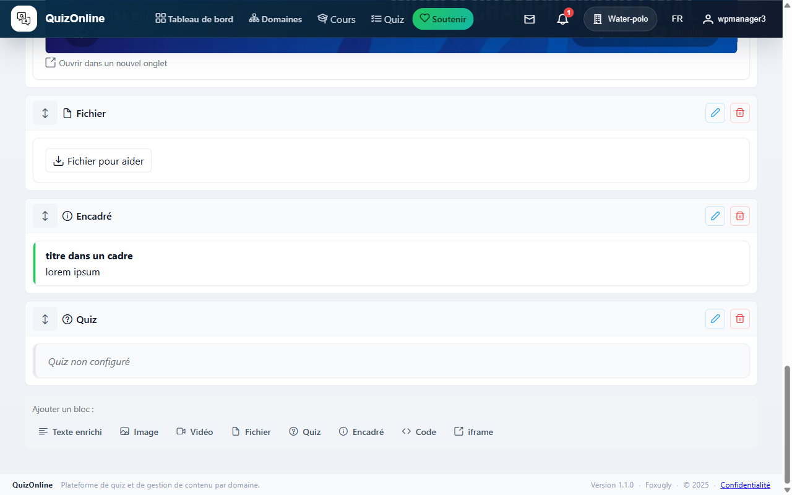

| Type | Usage | Notes |
|------|-------|-------|
| **Texte enrichi** | Paragraphes formatés, listes, citations, code inline | Éditeur Quill — couleurs, alignements, etc. HTML sanitisé serveur-side. |
| **Image** | Illustration | Upload via fileupload PrimeNG. Pas de redimensionnement automatique. |
| **Vidéo** | YouTube / Vimeo / upload | URL auto-détectée. Le rendu est un iframe live dans l'éditeur. |
| **Fichier** | PDF, slides, doc | L'apprenant voit un lien de téléchargement. |
| **Quiz** | Quiz intégré | Picker auto-complete sur les `QuizTemplate` du domaine du cours, score minimal configurable. |
| **Encadré** | Note, avertissement, conseil | Couleur configurable. |
| **Code** | Snippet | Coloration syntaxique selon le langage. |
| **Intégration** | Iframe externe | À utiliser avec parcimonie (cookies tiers, RGPD). |

### Auto-sauvegarde

Chaque édition de bloc est sauvegardée automatiquement via PATCH debouncé (1 s d'inactivité). Un indicateur « Enregistré » apparaît en bas du bloc.

## 5. Gérer les inscriptions

Onglet « Inscriptions » de `/course/<id>/edit`.

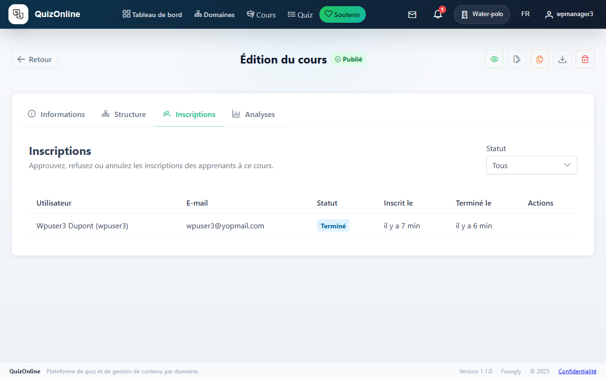

### Pour un cours sur validation

Les inscriptions arrivent en statut **En attente**. Boutons par ligne :

- **Approuver** — l'apprenant rejoint le cours, reçoit un email de confirmation.
- **Refuser** — la demande est rejetée, l'apprenant reçoit un email d'explication.

Filtre en haut pour ne voir que les pending, ou tout l'historique.

### Pour un cours sur invitation

Une section supplémentaire « Inviter un apprenant » s'affiche en haut, avec un picker auto-complete + un bouton « Envoyer ». Voir la section suivante.

## 6. Inviter des apprenants

Dans l'onglet « Inscriptions » d'un cours sur invitation.

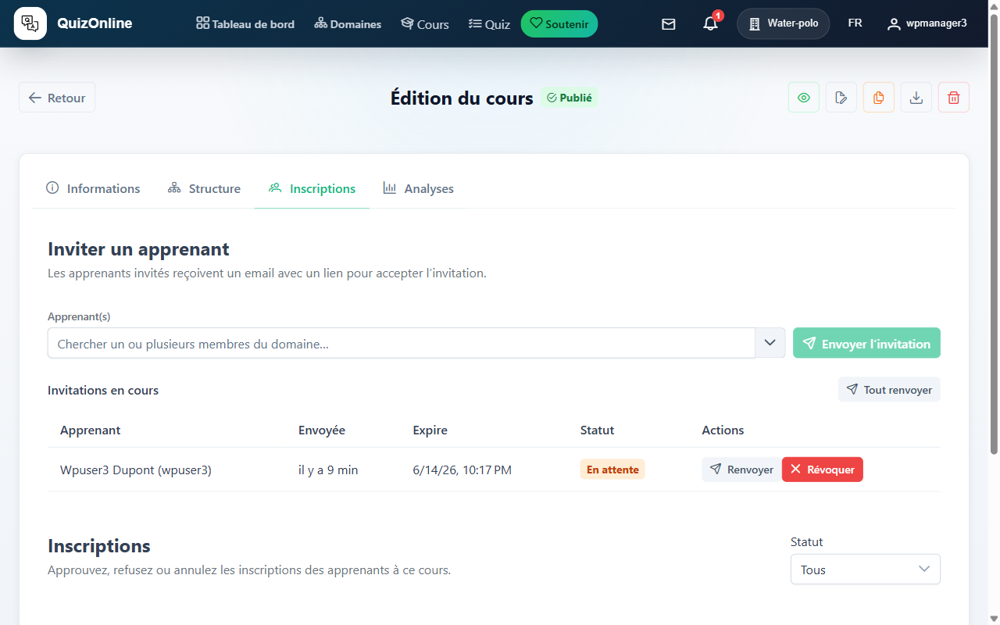

### Inviter un ou plusieurs membres

1. Tapez 2+ caractères dans le picker. Les membres du domaine du cours apparaissent (ceux déjà inscrits ou déjà invités sont filtrés).
2. Sélectionnez un ou plusieurs membres (multi-select). Le bouton « Envoyer X invitations » s'adapte.
3. Cliquez. Toutes les invitations partent en une seule requête réseau, et n'incrémentent qu'un seul hit dans le bucket de throttle `lms_invite_send` (50/min par défaut).

Les destinataires reçoivent un email avec un lien unique vers `/course-invite/<token>`. Le lien expire dans 14 jours. Un rappel automatique est envoyé 3 jours avant expiration s'ils n'ont pas accepté.

### Liste des invitations en cours

Sous le formulaire d'invitation, une table liste toutes les invitations en cours pour ce cours :

- **Apprenant** + **Envoyée** + **Expire** + **Statut** + actions.
- **Renvoyer** par ligne — pousse `expires_at` à +14 jours et réinitialise le rappel J-3.
- **Révoquer** par ligne — annule l'invitation, l'apprenant ne peut plus l'accepter.

### Tout renvoyer

Si vous avez beaucoup d'invitations en cours (cohorte qui démarre en retard, par exemple), un bouton « Tout renvoyer » au-dessus de la table renvoie toutes les invitations en cours en un seul clic. Une ligne est ajoutée à l'audit log avec `processed` et `skipped`.

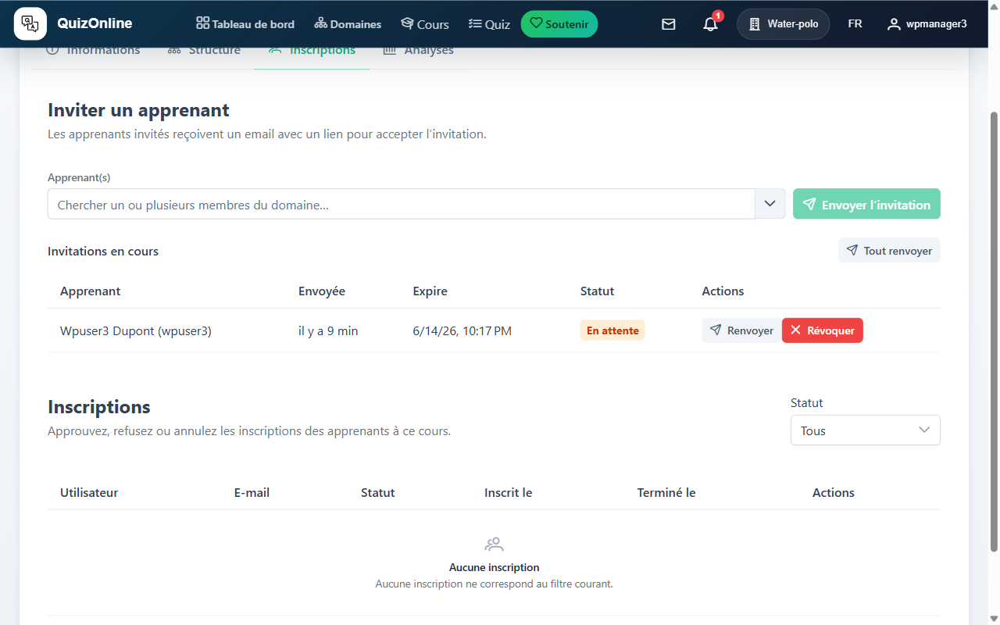

## 7. Publier ou dépublier

Un cours en mode **brouillon** est invisible au catalogue pour les non-instructeurs. Pour rendre visible : bouton œil (« Publier ») en haut à droite de la page d'édition.


Le cours doit avoir au moins une section publiée avec au moins une leçon publiée pour pouvoir être publié — sinon le serveur renvoie une erreur explicite.

Une fois publié, l'icône bascule en « œil barré » (« Dépublier »). Dépublier ne supprime rien : les inscriptions existantes restent, mais le cours redevient invisible aux nouveaux apprenants.

Un tag « Brouillon » centré sous l'en-tête rappelle l'état tant que ce n'est pas publié (visible aussi sur la page de détail et sur les cards du catalogue pour les instructeurs).

## 8. Cloner, exporter, supprimer

Trois boutons à droite de l'en-tête de la page d'édition :

- **Dupliquer** — crée une copie complète (sections + leçons + blocs) en mode brouillon. Utile pour démarrer un nouveau cours à partir d'un template existant.
- **Exporter (JSON)** — télécharge le cours au format JSON portable. Le payload est ré-importable via un endpoint API.
- **Supprimer** — supprime définitivement le cours, ses sections, ses leçons, ses blocs, **et toutes les inscriptions des apprenants**. ⚠️ Si le cours a déjà émis des certificats, la suppression est bloquée (les certificats sont protégés en cascade).

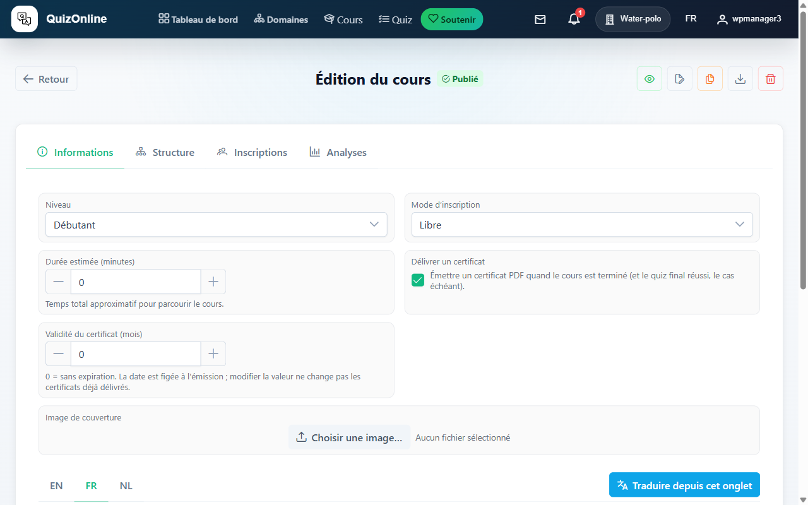

## 9. Analyses du cours

Onglet « Analyses » de `/course/<id>/edit`.

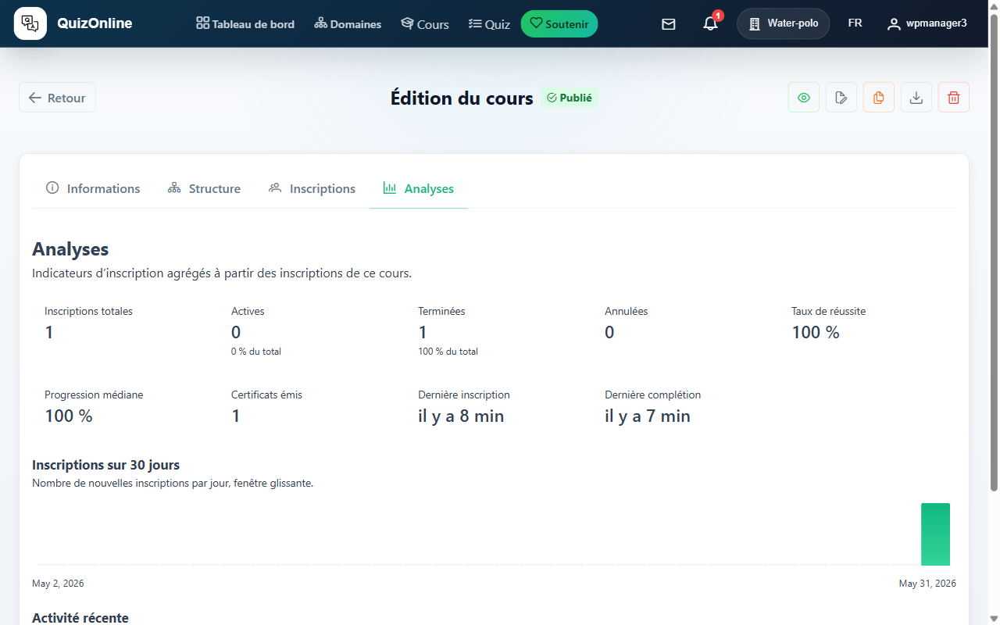

KPIs surfaceés :

- **Inscriptions totales** + ventilation actives / en attente / annulées.
- **Taux de complétion** — % d'inscrits qui ont terminé.
- **Progression médiane** — où en est l'apprenant médian.
- **Certificats émis**.
- **Sparkline 30 jours** — nouvelles inscriptions par jour.

Pour les cours sur invitation, une sous-section ajoute :

- Invitations envoyées, acceptées, refusées, expirées.
- Taux d'acceptation.
- Temps médian d'acceptation.

## 10. Vue admin : la liste des cours

`/course/list` (bouton « Liste » en haut à droite du catalogue) — une table admin de tous les cours que vous gérez, brouillons inclus.

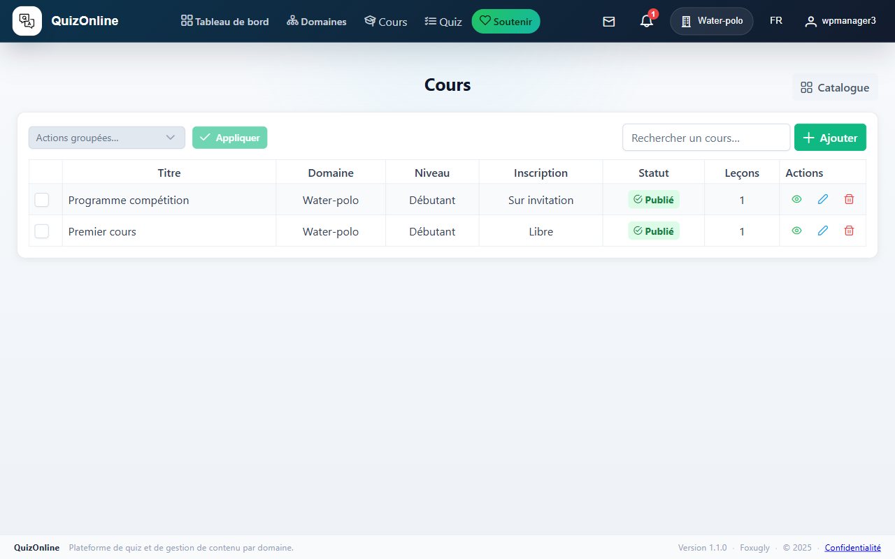

Colonnes : Titre, Domaine, Niveau, Mode d'inscription, Statut (Publié / Brouillon), Nombre de leçons, Actions.

Actions par ligne :

- Œil — ouvrir la page de détail.
- Crayon — éditer.

Actions groupées (sélection par checkbox) :

- **Publier** — publie en bloc.
- **Dépublier** — dépublie en bloc.
- **Supprimer** — supprime en bloc (confirmation requise, certificats protégés).

Paginator standard sous la table — page size 20.

## 11. La banque de questions : les sujets

Les **sujets** regroupent les questions par thème (chapitre, compétence visée, etc.). Ce n'est pas obligatoire — une question peut exister sans sujet — mais c'est ce qui permet de filtrer la bibliothèque côté éditeur de quiz et la liste des questions.

### Lister les sujets

`/subject/list` — table avec recherche libre et actions groupées (activer / désactiver / supprimer). Colonnes : nom, actif, domaine, nombre de questions liées.

### Créer un sujet

Bouton « + Ajouter » en haut à droite → `/subject/add`. Champs : **nom**, **actif** (oui/non), **domaine** (auto-rempli si vous n'en gérez qu'un, sinon picker).

### Éditer ou supprimer

Crayon par ligne — édite le nom, le domaine, l'état actif. Corbeille — supprime ; les questions liées sont détachées, pas supprimées.

## 12. Créer et importer des questions

`/question/list` — la bibliothèque de toutes les questions des domaines que vous gérez. Filtres :

- **Recherche libre** sur le titre.
- **Sujets** — multi-select. Active uniquement les questions qui ont au moins un des sujets cochés.

Colonnes : titre, actif, modes (Pratique / Examen / les deux), sujets, actions. Action groupée : activer / désactiver / supprimer.

### Créer une question

Bouton « Nouvelle question » en haut → `/question/add`. Le formulaire est en deux parties :

1. **Métadonnées** : actif, domaine, sujets (multi-select), modes (cocher Pratique et/ou Examen).
2. **Contenu par langue** : un onglet par langue autorisée du domaine. Vous éditez l'énoncé puis les options de réponse via les mêmes 8 types de blocs qu'une leçon (voir [chapitre 4](#4-les-8-types-de-blocs)). Bouton « Traduire depuis cet onglet » pour remplir les langues vides.

Sauvegarde automatique pendant l'édition.

### Modes Pratique vs Examen

- **Pratique** — la question est utilisable dans un quiz en mode pratique. La correction s'affiche immédiatement après chaque réponse, l'apprenant peut ré-essayer.
- **Examen** — la question est utilisable dans un quiz en mode examen. Le score n'est révélé qu'à la fin, et chaque modèle de quiz examen est **single-attempt** par apprenant.

Une question peut être cochée Pratique **et** Examen — c'est même le cas par défaut.

### Importer en masse

Bouton « Importer » à côté de « Nouvelle question » → `/question/import`. Charge un fichier pour créer plusieurs questions en une fois — utile pour migrer une banque existante.

## 13. Composer un modèle de quiz

`/quiz/list` — la page d'entrée. Deux onglets :

- **Modèles** — la liste des `QuizTemplate` des domaines que vous gérez. Boutons « Composer » (forme complète) et « Création rapide » en haut à droite.
- **Mes sessions** — vos propres `Quiz` (sessions en cours ou terminées, y compris en tant qu'instructeur).

### L'éditeur (`/quiz/add`)

Trois onglets :

#### Onglet « Textes »

Titre + description par langue (un onglet par langue autorisée), avec le bouton « Traduire depuis cet onglet ».

#### Onglet « Configuration »

Six sections de réglages :

- **Statut** — Actif (utilisable) / Public (visible dans le catalogue par tous les utilisateurs du domaine ; sinon visible uniquement par les apprenants à qui l'instructeur a affecté une session).
- **Mode** — Pratique / Examen. **Timer** : on/off, durée en minutes. À l'expiration, la session est soumise automatiquement.
- **Ordre** — « Mélanger les questions » : sinon, l'ordre est celui de l'onglet Questions.
- **Disponibilité** — **Permanent** (toujours ouvert) **ou** fenêtre avec « Démarre le » / « Termine le ». Hors fenêtre, le quiz est invisible dans le catalogue.
- **Visibilité du résultat** — Immédiate (à la soumission) / Planifiée (à partir d'une date) / Jamais.
- **Visibilité du détail** (questions + bonnes réponses) — Immédiate / Planifiée / Jamais. Indépendant de la visibilité du score.

#### Onglet « Questions »

Deux colonnes :

- **Bibliothèque** (gauche) — recherche libre + filtre par sujet. Bouton « + » sur chaque carte pour ajouter à la composition. Un bouton « + Créer » ouvre l'éditeur de question dans une dialogue sans quitter le quiz.
- **Composition** (droite) — vos questions dans l'ordre. Boutons haut/bas pour réordonner, croix pour retirer, champ de poids pour pondérer (le score est calculé pondéré).

Sauvegarde automatique avec un indicateur « Enregistré il y a X » en bas du formulaire.

### Création rapide

Pour un quiz mono-langue simple, le bouton « Création rapide » dans `/quiz/list` ouvre `/quiz/quick`, un formulaire allégé : titre + sélection de questions. Le quiz est créé avec les défauts (actif, non-public, pratique, sans timer, permanent).

## 14. Suivre les résultats d'un modèle

Depuis la liste des modèles dans `/quiz/list`, l'action « Résultats » mène à `/quiz/template/<templateId>/results` : la liste de toutes les sessions (`Quiz`) lancées sur ce modèle, par n'importe quel apprenant du domaine.

Colonnes : apprenant, date de démarrage, date de fin, score, état. Idéal pour surveiller la cohorte d'un quiz utilisé dans un cours, ou repérer une question systématiquement ratée.
