# Manuel — Apprenant

Vous êtes membre d'un domaine et vous voulez suivre des cours. Ce manuel couvre tout ce dont vous avez besoin du premier login au certificat.

> Retour au [sommaire](index.md).

## Sommaire

1. [Connexion et tableau de bord](#1-connexion-et-tableau-de-bord)
2. [Le catalogue de cours](#2-le-catalogue-de-cours)
3. [S'inscrire à un cours](#3-sinscrire-à-un-cours)
4. [Suivre une leçon](#4-suivre-une-leçon)
5. [Passer un quiz](#5-passer-un-quiz)
6. [Suivre ma progression](#6-suivre-ma-progression)
7. [Mes certificats](#7-mes-certificats)
8. [Gérer mes invitations](#8-gérer-mes-invitations)
9. [Préférences personnelles](#9-préférences-personnelles)

---

## 1. Connexion et tableau de bord

### Se connecter

Deux façons d'arriver sur la plate-forme :

- **Mot de passe classique** depuis `/login` : email + mot de passe.
- **Magic-link** depuis `/login` : saisir l'email et cliquer sur « Recevoir un lien de connexion ». Un email vous arrive avec un lien à usage unique, valable quelques minutes. Pratique si vous avez oublié votre mot de passe et que vous voulez éviter la procédure de reset.

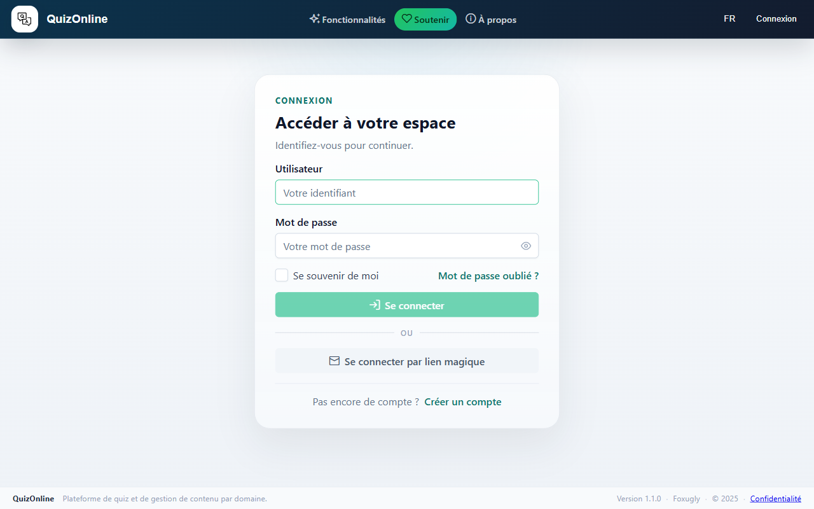

### Le tableau de bord

Après connexion vous arrivez sur `/dashboard`. C'est votre point de départ : il agrège tout ce qui vous concerne dans une grille de tuiles :

- **Cours en cours** — vos 3 cours les plus récemment actifs avec leur barre de progression.
- **Mes certificats** — compteur des certificats obtenus + lien vers la liste complète.
- **Mes quiz** — raccourci vers vos sessions de quiz.
- **Invitations en attente** — vos invitations à des cours (n'apparaît que si vous avez au moins une invitation, ou si vous êtes vous-même instructeur quelque part).
- **Catalogue** — raccourci vers le catalogue de cours.

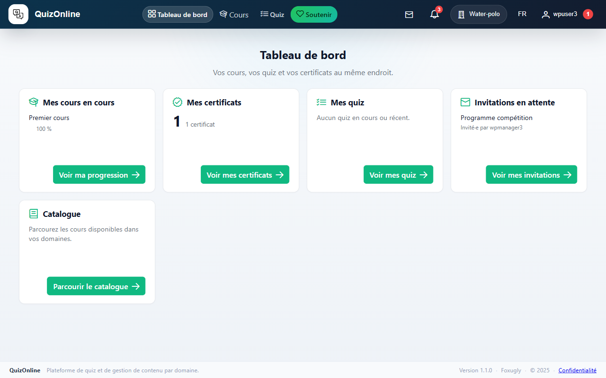

## 2. Le catalogue de cours

Le catalogue (`/catalog`) liste tous les cours **publiés** qui vous sont visibles dans vos domaines.

### Filtres

Trois filtres en haut de la page :

- **Recherche** — texte libre, cherche dans les titres et descriptions. Debouncé 300 ms, pas besoin de presser Entrée.
- **Niveau** — Débutant / Intermédiaire / Avancé.
- **Domaine** — n'apparaît que si vous êtes membre de plusieurs domaines.

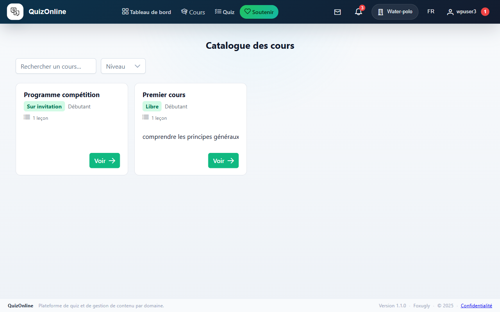

### Lire une card de cours

Chaque card contient le titre, un badge de mode d'inscription (Libre / Sur validation / Sur invitation), le niveau, le nombre de leçons, la durée estimée, et la description tronquée à 3 lignes. Si vous êtes déjà inscrit, un badge vert « Inscrit » apparaît et la barre de progression remplace partiellement le contenu de la card.

Cliquez sur « Voir » (ou « Reprendre » si vous êtes déjà inscrit avec une leçon non terminée) pour accéder au détail.

### Pagination

Sous la grille, un paginator permet de naviguer si votre domaine contient plus de 20 cours.

## 3. S'inscrire à un cours

La page de détail (`/course/<slug>`) affiche le titre, la description, les objectifs d'apprentissage (si renseignés), et l'arbre des sections + leçons.

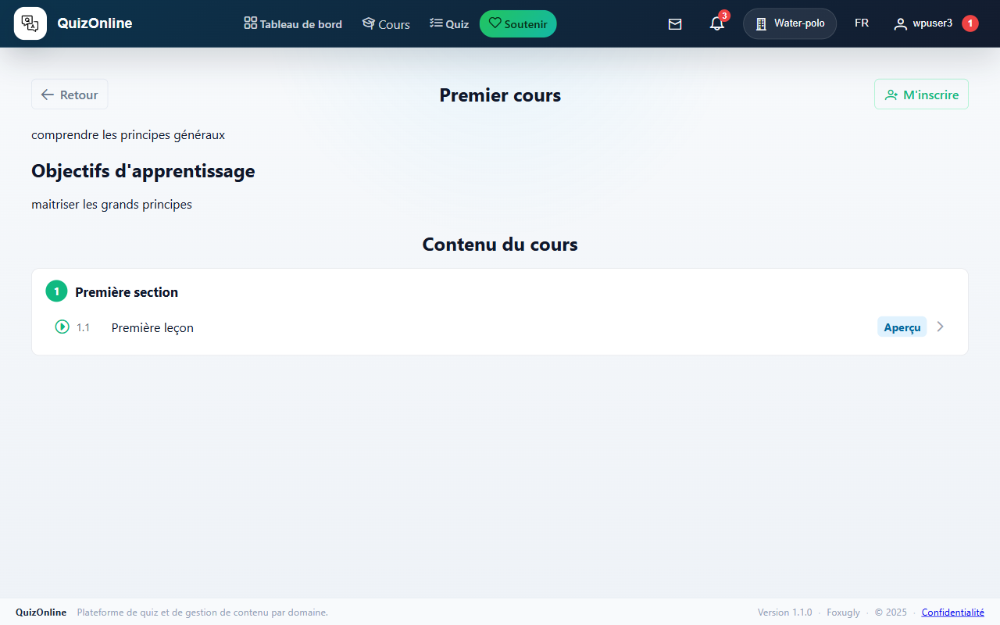

Le bouton à droite de l'en-tête dépend du mode d'inscription du cours et de votre statut :

| Mode | Vous n'êtes pas inscrit | Vous êtes inscrit |
|------|-------------------------|--------------------|
| Libre | « M'inscrire » — clic immédiat, vous êtes inscrit. | « Reprendre » — vous emmène à la prochaine leçon non terminée. |
| Sur validation | « M'inscrire » — votre demande passe en attente, un instructeur doit l'approuver. | Idem. |
| Sur invitation | Le cours n'est pas visible tant que vous n'avez pas reçu d'invitation. Sinon : « Accepter l'invitation ». | Idem. |

### Inscription sur invitation

Si vous avez reçu une invitation par email :

1. Cliquez sur le lien dans l'email — vous arrivez sur `/course-invite/<token>`.
2. Une page d'acceptation affiche le cours, qui vous a invité, et la date d'expiration.
3. Cliquez sur « Accepter l'invitation » pour vous inscrire et rejoindre le cours.

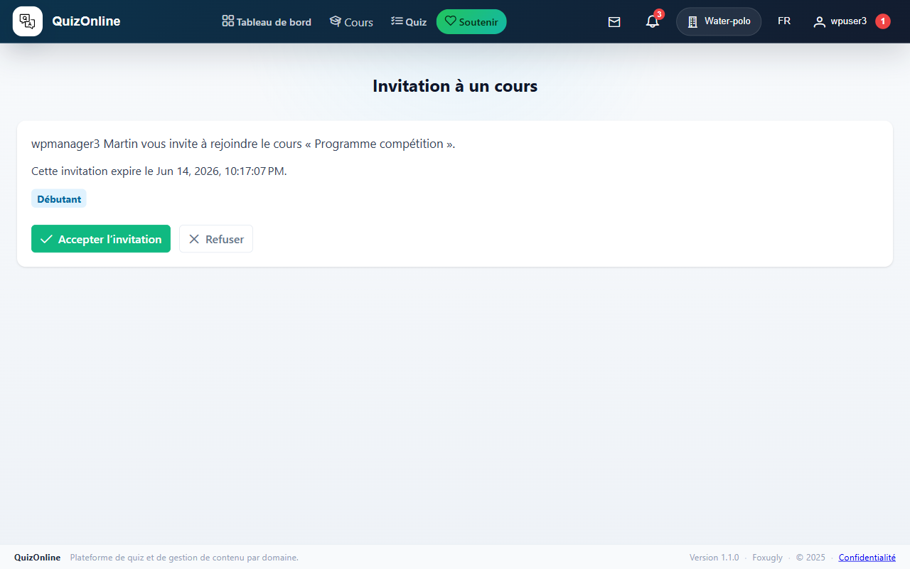

L'invitation expire automatiquement 14 jours après envoi. Vous recevrez un rappel par email 3 jours avant l'expiration si vous n'avez pas encore accepté.

## 4. Suivre une leçon

La page leçon (`/lesson/<id>`) est divisée en :

- **Sommaire de blocs** (à gauche, sticky sur desktop) — liste numérotée des blocs de contenu de la leçon, avec scroll-spy : le bloc visible est mis en évidence dans le sommaire.
- **Corps de la leçon** (à droite) — le contenu réel, un bloc par carte.
- **Notes privées** (en bas) — un champ texte où vous pouvez prendre des notes personnelles, persistées automatiquement (debouncé 600 ms).
- **Footer de navigation** — boutons « ← Leçon précédente », « Marquer comme terminée », « Leçon suivante → ».

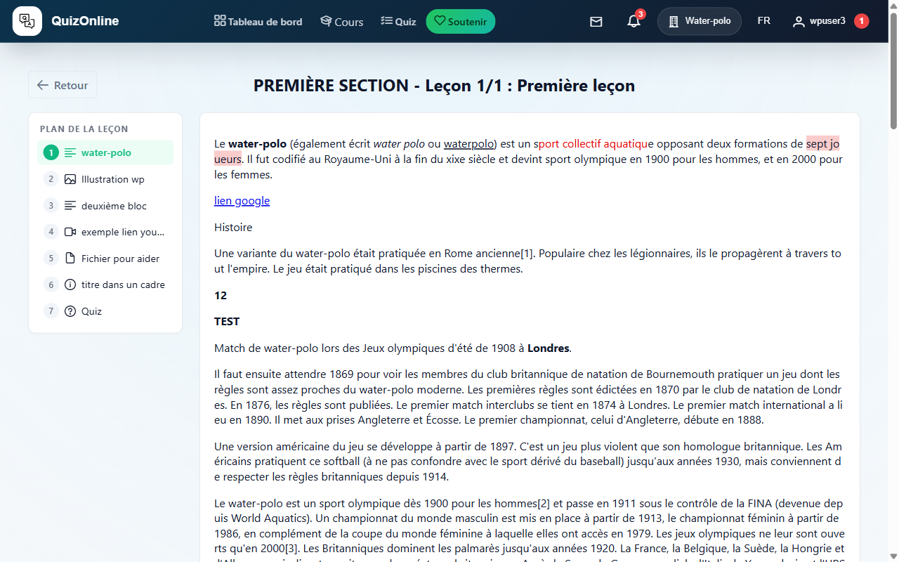

### Les types de blocs

Une leçon peut contenir 8 types de blocs :

- **Texte enrichi** — paragraphes formatés.
- **Image** — illustrations.
- **Vidéo** — YouTube, Vimeo ou fichier uploadé.
- **Fichier** — PDF ou document à télécharger.
- **Quiz** — un quiz intégré (voir section suivante).
- **Encadré** — note ou avertissement mis en valeur.
- **Code** — extrait de code avec coloration syntaxique.
- **Intégration** — contenu externe via iframe.

### Marquer une leçon comme terminée

Le bouton « Marquer comme terminée » au centre du footer enregistre la complétion. Le bouton « Leçon suivante » a un petit effet pulse juste après pour vous nudger vers la suite. La progression du cours est mise à jour automatiquement.

## 5. Passer un quiz

Si une leçon contient un bloc de type Quiz, vous verrez une card avec un bouton « Commencer le quiz ». Si vous avez déjà réussi le quiz, la card affiche votre score.

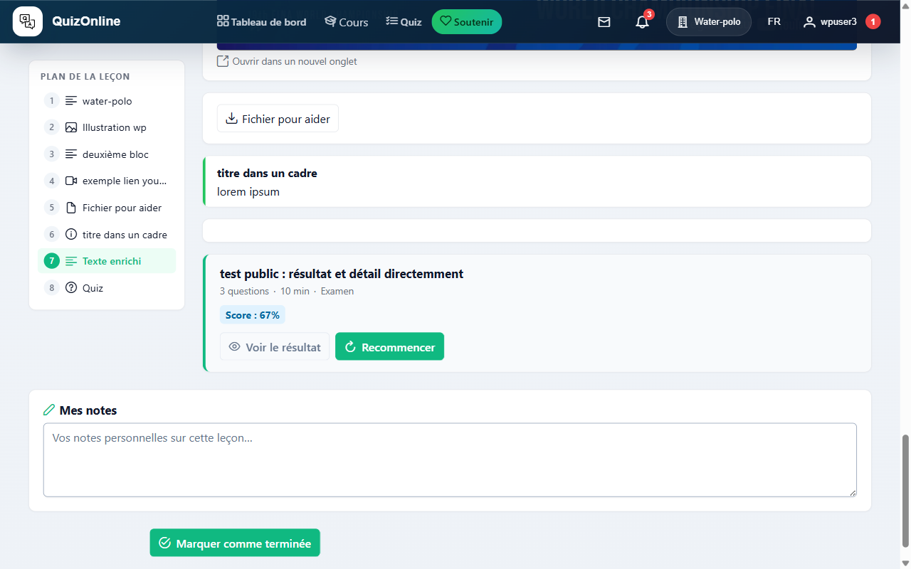

Une seconde entrée existe via `/quiz/list`, onglet « Modèles » : la liste de tous les quiz publics des domaines auxquels vous appartenez, avec un bouton « Démarrer » par carte. L'onglet « Mes sessions » liste vos sessions déjà créées (en cours ou terminées) pour les reprendre ou consulter le score.

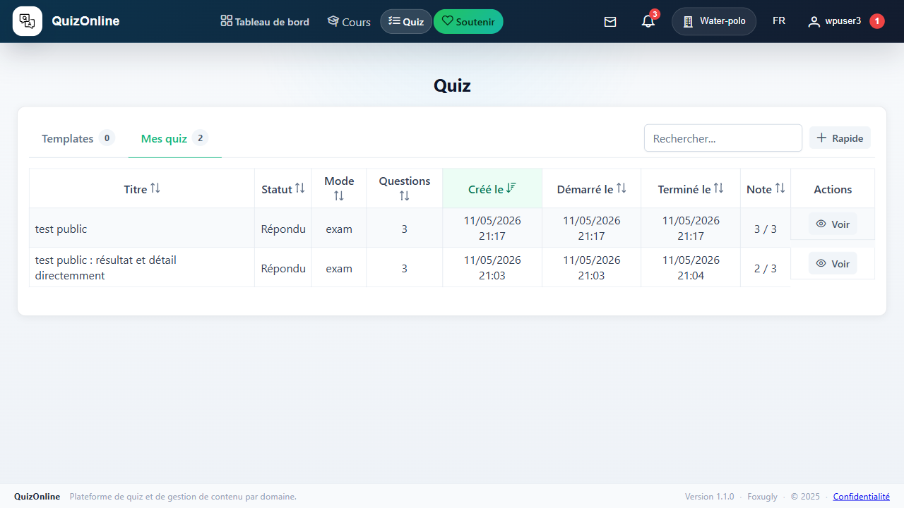

### L'interface du joueur

La page du joueur (`/quiz/<quizId>/questions`) est divisée en deux colonnes :

**Colonne gauche**

- **Compte à rebours** si le quiz a un timer. À zéro, la session est soumise automatiquement.
- **Grille de navigation** — un bouton par question, en grille de 5 colonnes. Chaque bouton indique l'état :
  - vide — pas encore vu ;
  - répondu — vous avez coché au moins une option ;
  - marqué pour relecture (drapeau) — vous voulez y revenir.

Cliquez un numéro pour sauter directement à cette question.

**Colonne droite** — la question courante :

- Énoncé (avec éventuellement images, vidéo, code, etc. — voir les blocs).
- Options de réponse à cocher (radio si une seule bonne réponse, checkbox si plusieurs).
- Bouton **Marquer pour relecture** — toggle du drapeau pour y revenir avant la soumission.
- Bouton **Signaler un problème** — envoie une alerte à l'instructeur (typo, mauvaise réponse, ambiguïté). Ouvre une dialogue pour décrire le souci.
- Boutons **Précédent** / **Suivant** / **Terminer** (sur la dernière question).

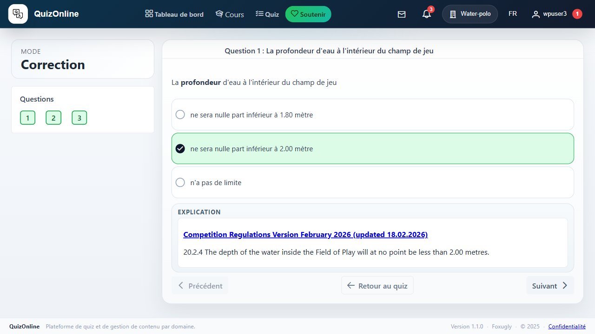

### Pratique vs Examen

- **Pratique** — la correction s'affiche immédiatement après chaque « Suivant ». Vous voyez vos erreurs et pouvez ré-essayer sur une nouvelle session.
- **Examen** — pas de correction tant que vous n'avez pas terminé. **Single-attempt** : une fois la session démarrée, vous ne pouvez plus en créer une autre sur le même modèle (sauf si l'instructeur supprime votre session).

### Soumettre et consulter le score

Bouton « Terminer » sur la dernière question (confirmation requise). Vous arrivez sur `/quiz/<quizId>`, le récap de session : date, durée, score, statut de réussite.

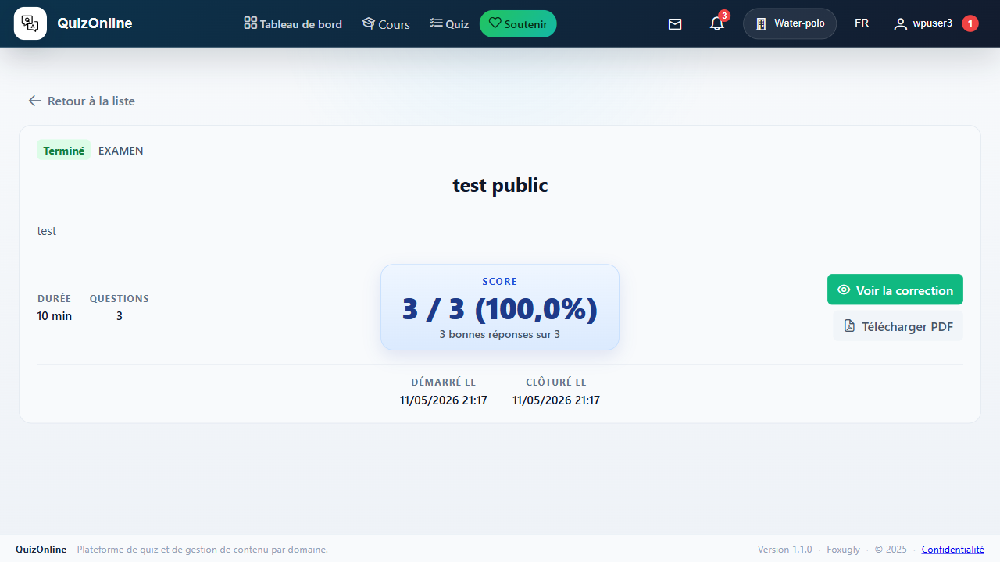

- Si la **visibilité du score** est immédiate, le score s'affiche ici. Si elle est planifiée, vous voyez un message « Disponible à partir du… » jusqu'à la date.
- Si la **visibilité du détail** l'autorise, un bouton « Réviser les questions » ouvre la grille en lecture seule avec vos réponses et les bonnes.

Réussir un quiz avec un score ≥ au seuil défini par l'instructeur marque automatiquement la leçon (ou le cours, pour un quiz final) comme terminée.

## 6. Suivre ma progression

`/me/progress` liste tous vos cours en cours (`enrollment` actif) avec leur barre de progression. Cliquez sur un cours pour reprendre.

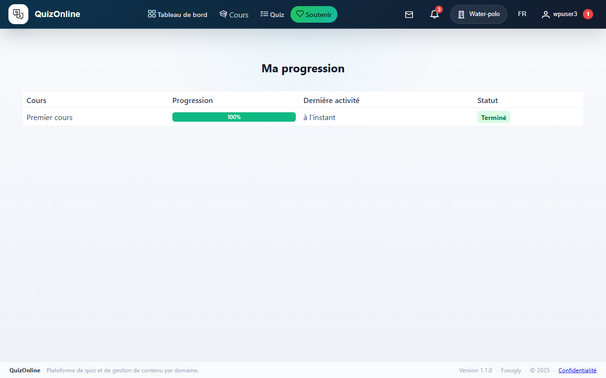

## 7. Mes certificats

`/me/certificates` liste les certificats que vous avez obtenus. Chaque certificat affiche le titre du cours, la date d'obtention, le numéro de certificat, et un bouton « Télécharger le PDF ».

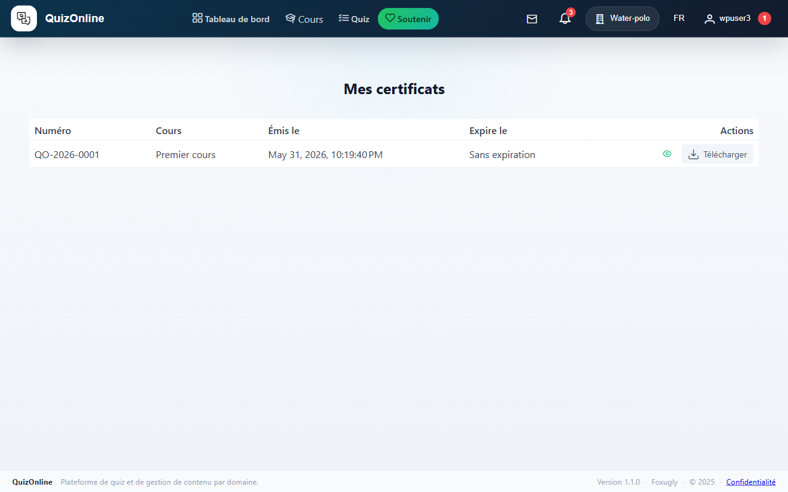

### Vérifier l'authenticité d'un certificat

Chaque certificat porte un **token de vérification public** au format `https://quizonline.foxugly.com/verify/<token>`. N'importe qui (même non connecté) peut ouvrir cette URL et confirmer que le certificat est authentique, qui l'a obtenu et quand. Pratique pour partager sur un CV ou LinkedIn.

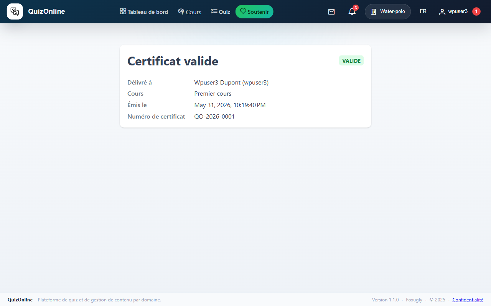

## 8. Gérer mes invitations

`/me/invitations` liste toutes vos invitations à des cours, organisées en deux onglets :

- **En attente** — invitations non encore acceptées (et non expirées). Bouton « Accepter » ou « Refuser » par ligne.
- **Historique** — tout le reste (acceptées, refusées, révoquées, expirées). Si acceptée, un bouton « Aller au cours » permet d'y retourner.

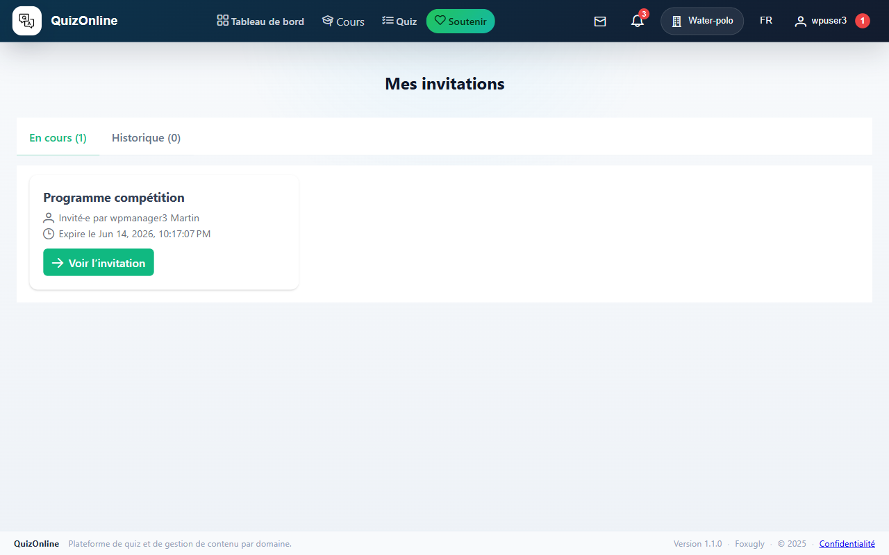

## 9. Préférences personnelles

`/preferences` (depuis le menu utilisateur en haut à droite) : modifier votre nom, votre email, votre mot de passe, votre langue d'interface (FR/EN/NL/IT/ES).

### Préférences de notification

Pour chaque type d'événement (invitation reçue, inscription approuvée, certificat émis, etc.) vous pouvez désactiver indépendamment :

- L'email (utile si vous lisez tout dans l'app).
- La notification web (cloche en haut à droite).

Les préférences sont par-domaine ET par-utilisateur — la notification s'envoie seulement si les DEUX permettent. Donc si vous mutez la cloche pour les invitations, vous n'en aurez plus, peu importe ce que fait le domaine.

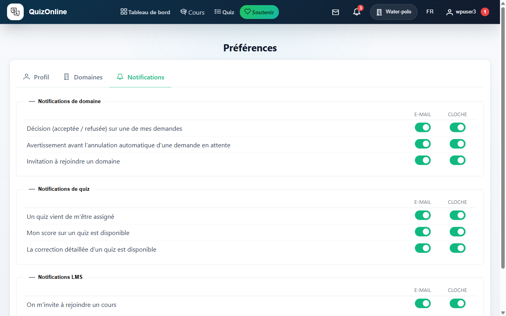
