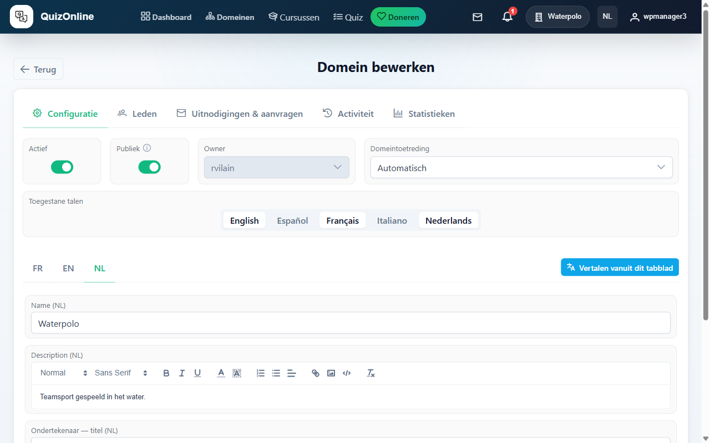
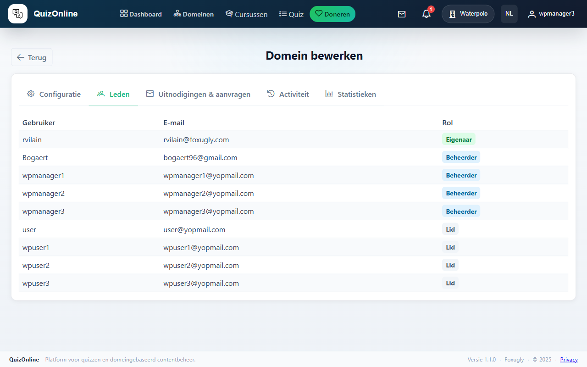
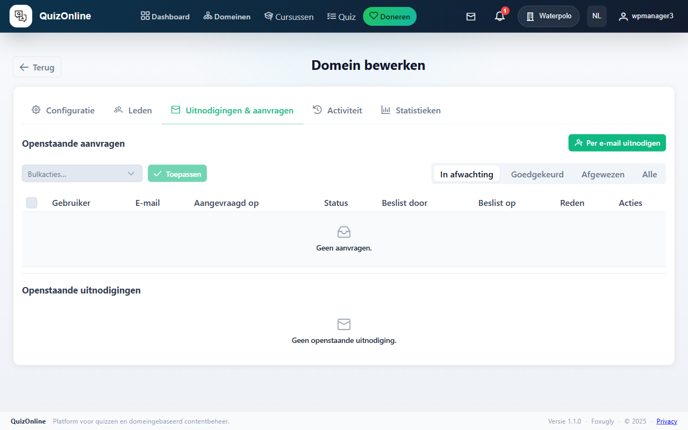
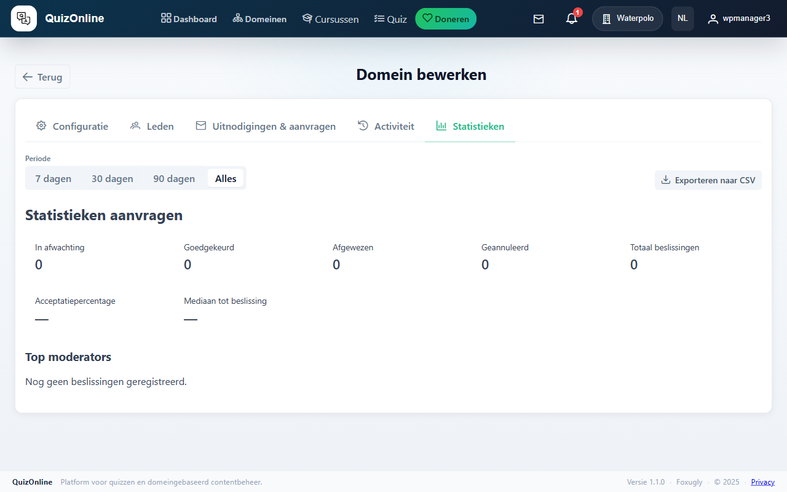
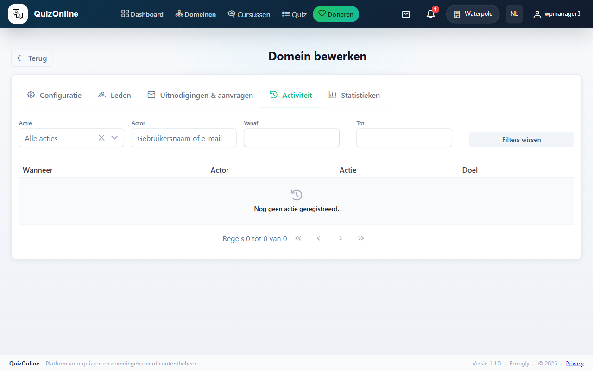
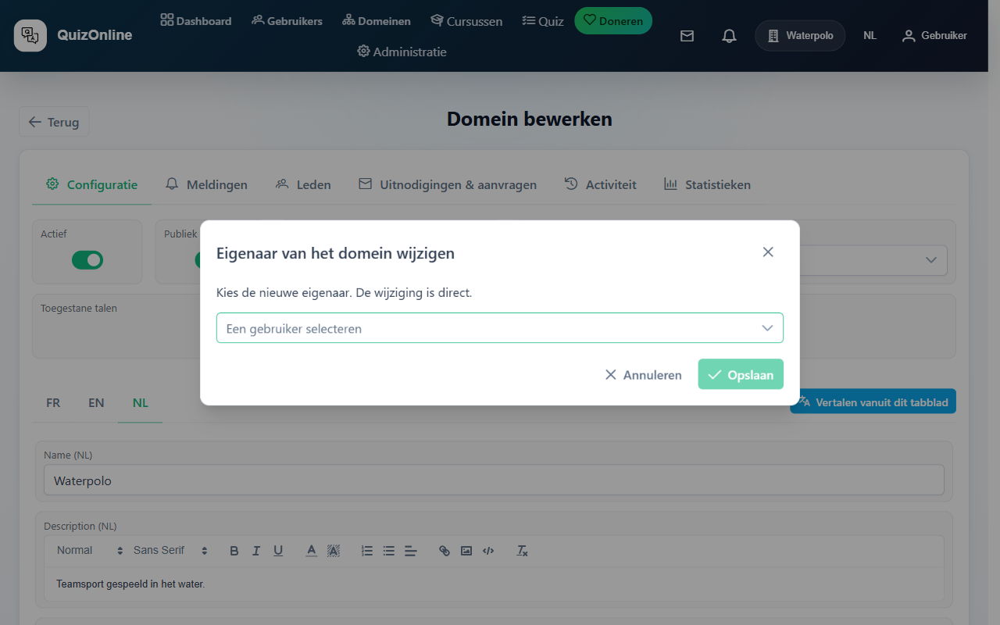
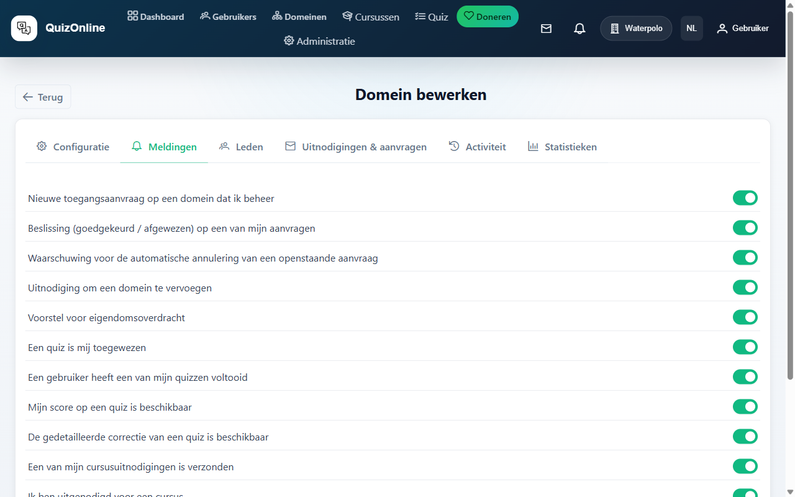

# Handleiding — Domeinbeheerder

Je bent de **eigenaar** van een domein. Deze handleiding behandelt het beheer van het domein zelf: leden, managers, talen, audit, eigendomsoverdracht, meldingen.

> Terug naar [index](index.md). Zie ook de [cursist](learner.md) en [instructeur](instructor.md) handleidingen — een domeinbeheerder is ook instructeur en cursist.

## Inhoudsopgave

1. [Wat is een domein](#1-wat-is-een-domein)
2. [Het domein configureren](#2-het-domein-configureren)
3. [Managers beheren](#3-managers-beheren)
4. [Leden beheren](#4-leden-beheren)
5. [Lidmaatschapsaanvragen](#5-lidmaatschapsaanvragen)
6. [Gebruikers uitnodigen](#6-gebruikers-uitnodigen)
7. [Domeinanalyses](#7-domeinanalyses)
8. [Het auditlog](#8-het-auditlog)
9. [Eigendom overdragen](#9-eigendom-overdragen)
10. [Domeinmeldingsvoorkeuren](#10-domeinmeldingsvoorkeuren)

---

## 1. Wat is een domein

Een **domein** is de belangrijkste isolatie-eenheid van het platform. Alles wat aangemaakt wordt (cursussen, quizzen, onderwerpen, vragen) behoort tot een domein. Rechten zijn beperkt tot het domein: een manager van het ene domein kan niets in een ander.

Drie rollen in een domein:

- **Eigenaar** — precies één. Volledige controle: managers toevoegen, eigendom overdragen, het domein verwijderen.
- **Manager** — meerdere mogelijk. Dezelfde rechten als de eigenaar behalve: kan eigendom niet overdragen en het domein niet verwijderen.
- **Lid** — cursist. Ziet de gepubliceerde cursussen van het domein en kan inschrijven volgens de toegestane modi.

## 2. Het domein configureren

Pagina `/domain/<id>/edit`. Verschillende tabs:

- **Configuratie** — naam, beschrijving, toegestane talen, afbeelding (meertalig via taaltabs), branding van het certificaat (logo + ondertekenaar).
- **Meldingen** — meldingsvoorkeuren op domeinniveau (zie sectie 10). *Alleen voor de eigenaar; managers zien deze tab niet.*
- **Leden** — leden + managers beheren.
- **Uitnodigingen & aanvragen** — lopende e-mailuitnodigingen en lidmaatschapsaanvragen, met bulk-goedkeuren/weigeren/intrekken.
- **Activiteit** — actiegeschiedenis (auditlog).
- **Statistieken** — KPI's.



### Toegestane talen

De talen die je hier inschakelt bepalen in welke talen cursussen aangemaakt en vertaald kunnen worden. Een taal afvinken nadat ze voor vertalingen gebruikt is, verwijdert de bestaande vertalingen niet — ze worden eenvoudigweg niet-bewerkbaar tot heractivering.

Keuzes: Frans, Engels, Nederlands, Italiaans, Spaans.

## 3. Managers beheren

Tab "Leden" van de domeinbewerkpagina. Managers hebben een speciale sectie bovenaan. Toevoegen of verwijderen via de auto-complete-kiezer.



Een manager wordt instructeur in jouw domein: hij of zij kan cursussen aanmaken, bewerken, publiceren, cursisten uitnodigen, enz. (zie de [instructeurhandleiding](instructor.md)).

## 4. Leden beheren

In dezelfde tab "Leden" toont de tabel van de leden voor elk: gebruikersnaam, e-mail, inschrijfdatum, laatste activiteit, acties.

Acties per rij:

- **Verwijderen** — sluit het lid uit van het domein. De cursusinschrijvingen blijven (status geannuleerd).

Bulk-acties (selectie via checkbox):

- **Bulkverwijderen** — bevestiging vereist.

## 5. Lidmaatschapsaanvragen

Tab "Uitnodigingen & aanvragen". Toont alle lopende lidmaatschapsaanvragen met:

- Gebruikersnaam en e-mail van de aanvrager.
- Bericht (indien aanwezig).
- Aanvraagdatum.
- Knoppen "Goedkeuren" / "Weigeren".


### Bulk-goedkeuring / -weigering

Selecteer meerdere rijen via checkboxes, daarna "Alles goedkeuren" of "Alles weigeren" boven de tabel. Eén netwerkaanvraag, één auditlog-rij.

### Automatische vervaldatum

Onbesliste aanvragen vervallen automatisch na 30 dagen. Een waarschuwing wordt 3 dagen daarvoor naar de aanvrager gestuurd.

## 6. Gebruikers uitnodigen

Zelfde tab "Uitnodigingen & aanvragen". Om iemand vooraf uit te nodigen (via e-mail) voordat hij of zij zich op het platform registreert — handig voor gebruikers die nog niet bestaan.



### Uitnodigen

Voer een lijst van e-mails in (één per regel). Bij verzending:

- Elke e-mail ontvangt een uitnodigingslink die 14 dagen geldig is.
- Als je meerdere domeinen beheert, kun je "Ook uitnodigen voor deze domeinen" aanvinken om dezelfde e-maillijst over meerdere domeinen in één aanvraag te verspreiden.
- De operatie telt als één hit in de `domain_invite_fanout`-throttle.

### Opnieuw verzenden / intrekken

Elke verzonden uitnodiging verschijnt in de tabel met verzenddatum, vervaldatum, status (in afwachting / aanvaard / ingetrokken / vervallen). Knoppen "Opnieuw verzenden" en "Intrekken" per rij.

## 7. Domeinanalyses

Tab "Statistieken" van de bewerkpagina.



KPI's:

- Tellers: leden, managers, aanvragen in afwachting.
- Aanvaardingsgraad van lidmaatschapsaanvragen.
- Mediane beslissingstijd (uren).
- Top 5 moderators (wie goedkeurt/weigert het meest).

30-daagse trendlijn op goedkeuringen / weigeringen.

## 8. Het auditlog

Tab "Activiteit" van de bewerkpagina. Toont de laatste 200 acties op het domein, gesorteerd van meest recent naar oudst.



Geauditeerde acties: lid toevoegen/verwijderen, aanvraag goedkeuren/weigeren, uitnodiging verzenden/intrekken, eigendomsoverdracht, wijziging van toegestane talen, enz.

Elke rij draagt: tijdstempel, actor, actie, metadata (ruwe JSON, uitvouwbaar bij klikken).

## 9. Eigendom overdragen

De eigenaar kan het domein overdragen aan een andere gebruiker (een domeinlid, of zelfs een externe gebruiker via e-mail). Onomkeerbare actie — wees zeker.

Knop "Eigendom overdragen" in tab "Configuratie". Voer de e-mail van de ontvanger in.



De ontvanger krijgt een e-mail met een ondertekende link naar `/transfer/accept/<token>`. Zolang hij of zij niet klikt en bevestigt, **blijf jij de eigenaar**. Bij aanvaarding:

- De ontvanger wordt eigenaar.
- Jij wordt manager (je behoudt de instructeursrechten).
- Een auditlog-rij wordt aangemaakt.

De token vervalt over 7 dagen. Als de ontvanger niet handelt, moet je opnieuw verzenden.

## 10. Domeinmeldingsvoorkeuren

Tab "Meldingen" van de bewerkpagina. **Alleen voor de eigenaar** — managers zien deze tab niet.

Het is een **globale kill-switch per categorie**, geen e-mail-vs-bel-schakelaar zoals in `/preferences` aan de gebruikerskant. Elke rij heeft één enkele AAN/UIT-schakelaar: als je hem op UIT zet, ontvangt **geen enkele** ontvanger in het domein deze melding nog, ongeacht hun persoonlijke voorkeuren.

### De 13 categorieën

**Domein:**

- Lidmaatschapsaanvraag ontvangen
- Beslissing (aanvaard / geweigerd) op een aanvraag
- Waarschuwing vóór de vervaldatum van een lopende aanvraag
- Uitnodiging voor een domein
- Eigendomsoverdracht ontvangen

**Quiz:**

- Een quiz is zojuist toegewezen
- Een toegewezen quiz is voltooid
- Mijn score is beschikbaar
- De gedetailleerde correctie is beschikbaar

**LMS (cursussen):**

- Cursusuitnodiging verzonden
- Cursusuitnodiging ontvangen
- Cursusuitnodiging aanvaard
- Inschrijvingsaanvraag voor een cursus aangemaakt

### De intersectieregel

Een melding wordt **alleen verzonden als beide opt-ins AAN staan**:

```
melding verzonden  ⇔  user-pref AAN  EN  domain-pref AAN
```

Dus:

- Als je `Uitnodiging voor een domein` hier uitschakelt → **niemand** in het domein ontvangt deze melding nog, zelfs gebruikers die ze individueel ingeschakeld hebben.
- Als een gebruiker ze uitschakelt in `/preferences` → **alleen die gebruiker** ontvangt ze niet meer, de anderen blijven ongewijzigd.

Handig voor domeinen die de ruis tot een minimum willen beperken (bv. een "productie"-domein dat alleen kritieke alerts wil).


