# Handleiding — Instructeur

Je bent manager van een domein. Je kunt cursussen maken, hun inhoud structureren, cursisten uitnodigen, inschrijvingen volgen en publiceren.

> Terug naar [index](index.md). Zie ook de [cursisthandleiding](learner.md) — een instructeur is ook een cursist.

## Inhoudsopgave

1. [Voorwaarde: instructeur zijn](#1-voorwaarde-instructeur-zijn)
2. [Een cursus aanmaken](#2-een-cursus-aanmaken)
3. [De cursus structureren](#3-de-cursus-structureren)
4. [De 8 bloktypes](#4-de-8-bloktypes)
5. [Inschrijvingen beheren](#5-inschrijvingen-beheren)
6. [Cursisten uitnodigen](#6-cursisten-uitnodigen)
7. [Publiceren of depubliceren](#7-publiceren-of-depubliceren)
8. [Klonen, exporteren, verwijderen](#8-klonen-exporteren-verwijderen)
9. [Cursusanalyses](#9-cursusanalyses)
10. [Beheerderbeeld: de cursuslijst](#10-beheerderbeeld-de-cursuslijst)
11. [De vragenbank: onderwerpen](#11-de-vragenbank-onderwerpen)
12. [Vragen maken en importeren](#12-vragen-maken-en-importeren)
13. [Een quizsjabloon samenstellen](#13-een-quizsjabloon-samenstellen)
14. [Resultaten van een sjabloon volgen](#14-resultaten-van-een-sjabloon-volgen)

---

## 1. Voorwaarde: instructeur zijn

Je bent instructeur als je **eigenaar** of **manager** bent van een domein. De domeinbeheerder voegde je toe aan de managerslijst (zie de [beheerderhandleiding](admin.md#3-managers-beheren)).

Instructeursacties zijn zichtbaar op de volgende pagina's:

- Knop "Een cursus aanmaken" rechtsboven in `/catalog`.
- Knop "Lijst" rechtsboven in `/catalog`, die naar `/course/list` leidt.
- Klein potlood rechtsboven op elke cursuskaart in `/catalog` voor de cursussen die je beheert.
- Label "Gepubliceerd" / "Concept" op elke kaart en op `/course/<slug>` waar je beheerrechten hebt.

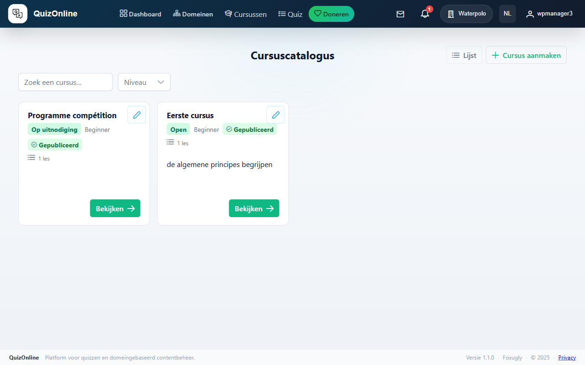

## 2. Een cursus aanmaken

Klik vanuit de catalogus op "Een cursus aanmaken" rechtsboven. Je komt op `/course/new`:

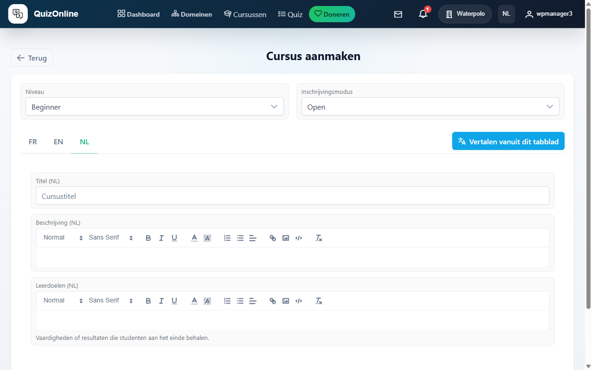

Het **domein** van de cursus is dat wat actief is in de bovenbalk (het label rechts van de navigatietabs — "Water-polo" in de screenshot). Om een cursus in een ander domein aan te maken, schakel je daar eerst naartoe vanuit de domeinenlijst. De **talen** die als tabs verschijnen zijn de `allowed_languages` van dat domein, en de eerste in die lijst wordt de hoofdtaal van de cursus.

Formuliervelden:

- **Niveau** — Beginner / Gevorderd / Expert.
- **Inschrijvingsmodus**:
  - **Vrij**: elk domeinlid kan zich in één klik inschrijven.
  - **Op goedkeuring**: de inschrijvingen gaan in afwachting en moeten één voor één goedgekeurd worden in de tab "Inschrijvingen".
  - **Op uitnodiging**: de cursus is onzichtbaar in de catalogus voor leden zonder lopende uitnodiging.
- **Titel**, **Beschrijving**, **Leerdoelen** — één tab per toegestane taal. De knop "Vertaal vanuit deze tab" vult de lege velden in de andere talen op basis van de inhoud van de actieve tab (handig om een vertaling te starten).

De **slug** wordt server-side gegenereerd op basis van de titel en **bevroren na het aanmaken** (URL-stabiliteit gaat boven cosmetica) — daarom verschijnt hij niet in het formulier.

Na het aanmaken kom je op `/course/<id>/edit` terecht, de bewerk-shell.

## 3. De cursus structureren

De bewerkpagina heeft 4 tabs:

- **Informatie** — metadata (titel, beschrijving, doelstellingen, geschatte duur, cover). Meertalig via taaltabs.
- **Structuur** — secties + lessen + blokken. Drag-and-drop om te herordenen.
- **Inschrijvingen** — wie ingeschreven is, wie wacht, lopende uitnodigingen.
- **Analyses** — KPI's en 30-daagse trendlijn.

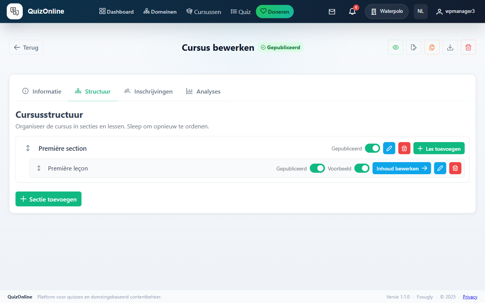

### Hiërarchie

```
Cursus
└── Sectie 1
    ├── Les 1.1
    │   ├── Rijke-tekst-blok
    │   ├── Video-blok
    │   └── Quiz-blok
    └── Les 1.2
└── Sectie 2
    └── ...
```

### Herordenen

Elk niveau (secties, lessen, blokken) ondersteunt drag-and-drop. De greep staat links van het item. De volgorde wordt onmiddellijk opgeslagen.

### Bewerken per taal

Elke les, sectie en vertaalbaar blok (titel, beschrijving, rijke-tekst-inhoud) is bewerkbaar per taal via tabs bovenaan de blokbewerker. Een knop "Vertaal vanaf dit tabblad" vult lege velden in een andere taal door de inhoud van de actieve taal te kopiëren (handig om een vertaling te starten).

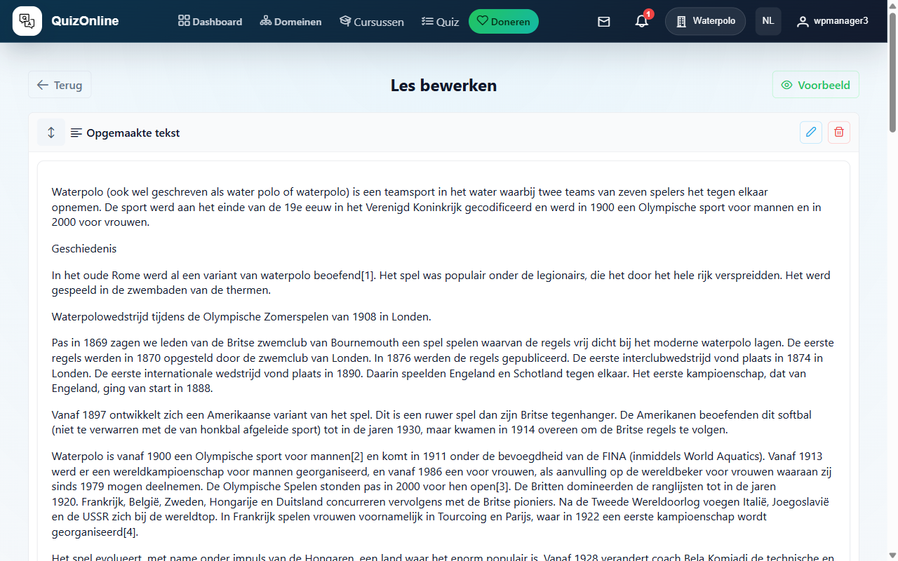

### Cursistvoorbeeld

Een oog-knop in de lesbewerker opent het voorbeeld zoals een cursist het ziet (alleen-lezen, in de bewerkcontext) zodat je de weergave kunt nakijken.

## 4. De 8 bloktypes

De lesbewerker (`/lesson/<id>/edit`) biedt 8 bloktypes aan. Klik op "Een blok toevoegen" om de kiezer te openen:

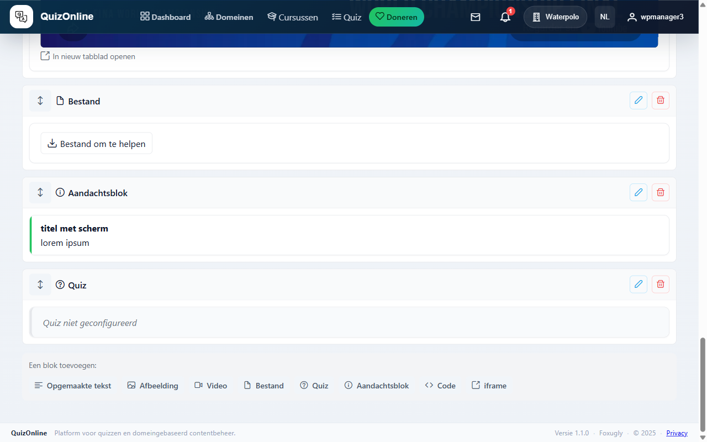

| Type | Gebruik | Opmerkingen |
|------|---------|-------------|
| **Rijke tekst** | Opgemaakte paragrafen, lijsten, citaten, inline code | Quill-editor — kleuren, uitlijning, enz. HTML server-side ontsmet. |
| **Afbeelding** | Illustratie | Upload via PrimeNG-fileupload. Geen automatische schaling. |
| **Video** | YouTube / Vimeo / upload | URL automatisch herkend. De weergave is een live iframe in de bewerker. |
| **Bestand** | PDF, slides, document | Cursisten zien een downloadlink. |
| **Quiz** | Ingesloten quiz | Auto-complete-kiezer over de `QuizTemplate`s van het cursusdomein, minimumscore configureerbaar. |
| **Kader** | Nota, waarschuwing, tip | Configureerbare kleur. |
| **Code** | Fragment | Syntaxiskleuring per taal. |
| **Insluiting** | Externe iframe | Spaarzaam gebruiken (third-party cookies, AVG). |

### Auto-opslaan

Elke blokbewerking wordt automatisch opgeslagen via vertraagde PATCH (1 s inactiviteit). Een "Opgeslagen"-indicator verschijnt onderaan het blok.

## 5. Inschrijvingen beheren

Tab "Inschrijvingen" van `/course/<id>/edit`.

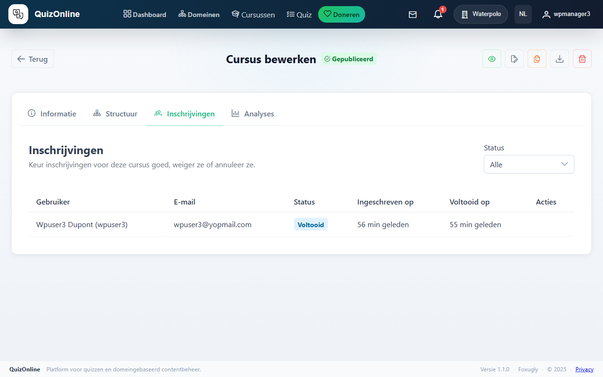

### Voor een cursus op goedkeuring

Inschrijvingen komen aan in status **In afwachting**. Knoppen per rij:

- **Goedkeuren** — de cursist sluit aan bij de cursus en ontvangt een bevestigingsmail.
- **Weigeren** — de aanvraag wordt afgewezen en de cursist ontvangt een uitlegmail.

Filter bovenaan om alleen de afwachting of de volledige geschiedenis te zien.

### Voor een cursus op uitnodiging

Een extra sectie "Een cursist uitnodigen" verschijnt bovenaan, met een auto-complete-kiezer en een knop "Verzenden". Zie volgende sectie.

## 6. Cursisten uitnodigen

In de tab "Inschrijvingen" van een uitnodigingsmodus-cursus.

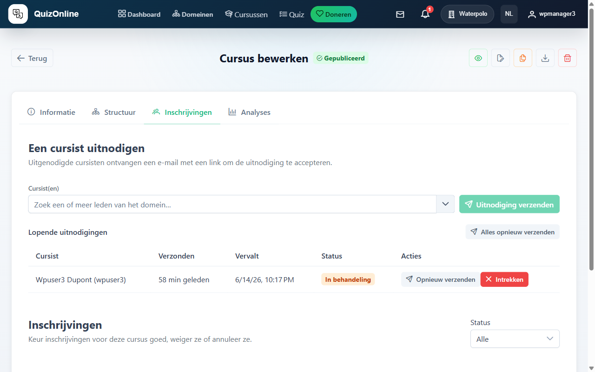

### Eén of meerdere leden uitnodigen

1. Typ 2+ tekens in de kiezer. De domeinleden verschijnen (al ingeschreven of al uitgenodigde worden uitgefilterd).
2. Selecteer één of meerdere leden (multi-select). De knop "X uitnodigingen verzenden" past zich aan.
3. Klik. Alle uitnodigingen gaan in één netwerkaanvraag de deur uit en tellen als één hit in de `lms_invite_send`-throttle-bucket (50/min standaard).

Ontvangers krijgen een e-mail met een unieke link naar `/course-invite/<token>`. De link vervalt over 14 dagen. Een automatische herinnering wordt 3 dagen voor de vervaldatum gestuurd als ze nog niet aanvaard hebben.

### Lijst van lopende uitnodigingen

Onder het uitnodigingsformulier toont een tabel alle lopende uitnodigingen voor deze cursus:

- **Cursist** + **Verzonden** + **Vervalt** + **Status** + acties.
- **Opnieuw verzenden** per rij — duwt `expires_at` naar +14 dagen en herstart de D-3 herinnering.
- **Intrekken** per rij — annuleert de uitnodiging; de cursist kan ze niet meer aanvaarden.

### Alles opnieuw verzenden

Als je veel lopende uitnodigingen hebt (een groep die laat start, bv.), stuurt een knop "Alles opnieuw verzenden" boven de tabel ze allemaal in één klik opnieuw. Een rij wordt toegevoegd aan het auditlog met `processed` en `skipped`.

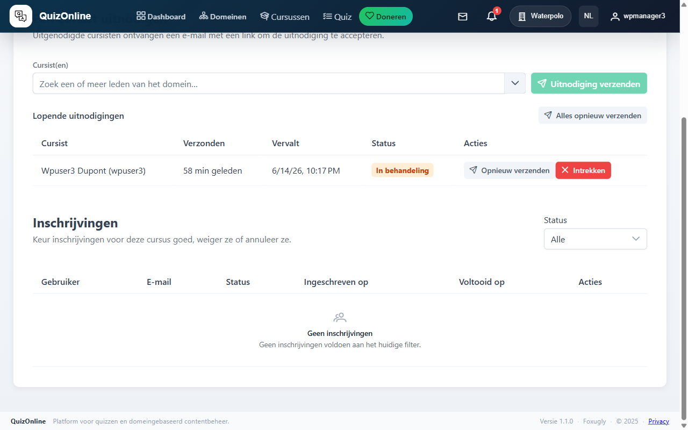

## 7. Publiceren of depubliceren

Een cursus in **concept**-modus is onzichtbaar in de catalogus voor niet-instructeurs. Om zichtbaar te maken: oog-knop ("Publiceren") rechtsboven op de bewerkpagina.

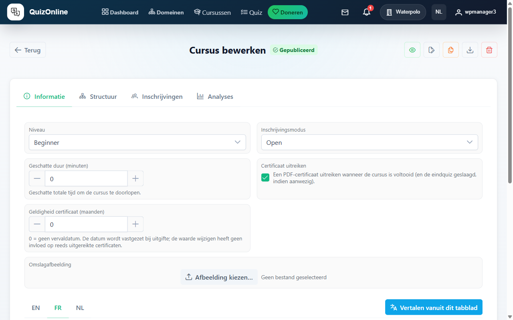

De cursus moet minstens één gepubliceerde sectie met minstens één gepubliceerde les hebben om gepubliceerd te kunnen worden — anders geeft de server een expliciete fout terug.

Eens gepubliceerd, schakelt het icoon naar "doorgehaald oog" ("Depubliceren"). Depubliceren verwijdert niets: bestaande inschrijvingen blijven, maar de cursus wordt onzichtbaar voor nieuwe cursisten.

Een gecentreerd "Concept"-label onder de header herinnert aan de status zolang er niet gepubliceerd is (ook zichtbaar op de detailpagina en op catalogus-kaarten voor instructeurs).

## 8. Klonen, exporteren, verwijderen

Drie knoppen rechts in de header van de bewerkpagina:

- **Dupliceren** — maakt een volledige kopie (secties + lessen + blokken) in conceptmodus. Handig om een nieuwe cursus te starten vanuit een bestaand sjabloon.
- **Exporteren (JSON)** — downloadt de cursus als draagbare JSON. De payload kan opnieuw geïmporteerd worden via een API-endpoint.
- **Verwijderen** — verwijdert de cursus permanent, evenals de secties, lessen, blokken **en alle cursistinschrijvingen**. ⚠️ Als de cursus al certificaten uitgereikt heeft, wordt de verwijdering geblokkeerd (certificaten zijn cascadebeschermd).


## 9. Cursusanalyses

Tab "Analyses" van `/course/<id>/edit`.

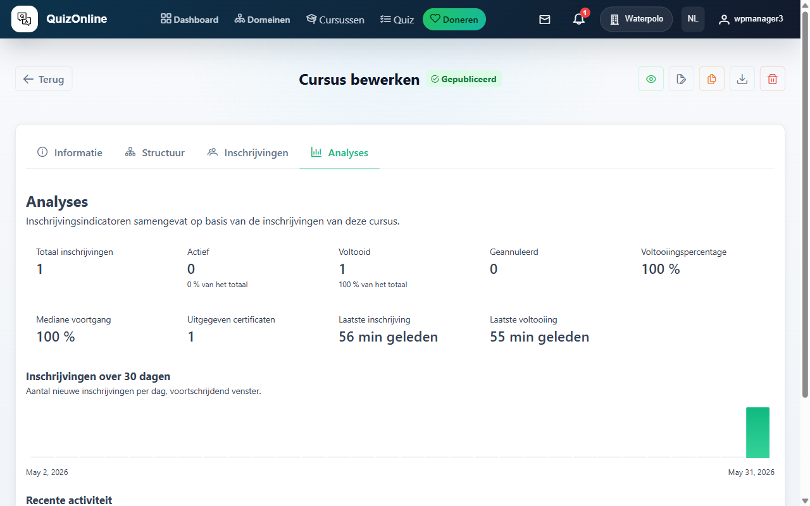

Getoonde KPI's:

- **Totale inschrijvingen** + uitsplitsing actief / in afwachting / geannuleerd.
- **Voltooiingsgraad** — % van de ingeschrevenen dat afgerond heeft.
- **Mediane voortgang** — waar de mediane cursist staat.
- **Uitgegeven certificaten**.
- **30-daagse trendlijn** — nieuwe inschrijvingen per dag.

Voor cursussen op uitnodigingsmodus voegt een sub-sectie het volgende toe:

- Uitnodigingen verzonden, aanvaard, geweigerd, vervallen.
- Aanvaardingsgraad.
- Mediane aanvaardingstijd.

## 10. Beheerderbeeld: de cursuslijst

`/course/list` (knop "Lijst" rechtsboven in de catalogus) — een beheerderstabel van alle cursussen die je beheert, inclusief concepten.

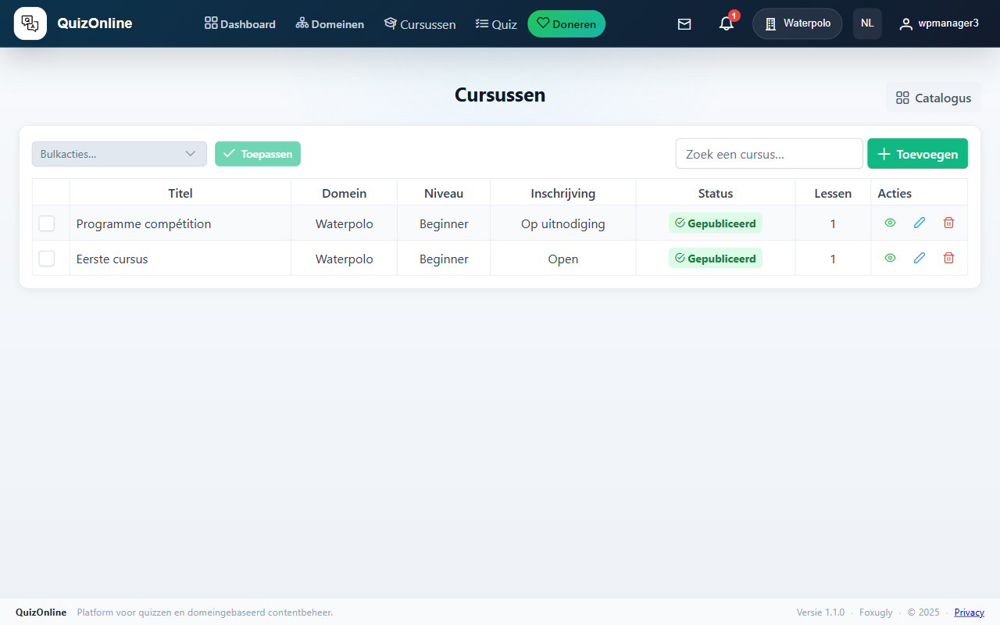

Kolommen: Titel, Domein, Niveau, Inschrijvingsmodus, Status (Gepubliceerd / Concept), Aantal lessen, Acties.

Acties per rij:

- Oog — open de detailpagina.
- Potlood — bewerken.

Bulk-acties (selectie via checkbox):

- **Publiceren** — publiceer in bulk.
- **Depubliceren** — depubliceer in bulk.
- **Verwijderen** — verwijder in bulk (bevestiging vereist, certificaten beschermd).

Standaard paginator onder de tabel — paginagrootte 20.

## 11. De vragenbank: onderwerpen

**Onderwerpen** groeperen vragen per thema (hoofdstuk, doelvaardigheid, enz.). Niet verplicht — een vraag kan zonder onderwerp bestaan — maar het is wat je toelaat om de bibliotheek in de quiz-editor en de vragenlijst te filteren.

### Onderwerpen lijsten

`/subject/list` — tabel met vrije zoekopdracht en bulk-acties (activeren / deactiveren / verwijderen). Kolommen: naam, actief, domein, aantal gekoppelde vragen.

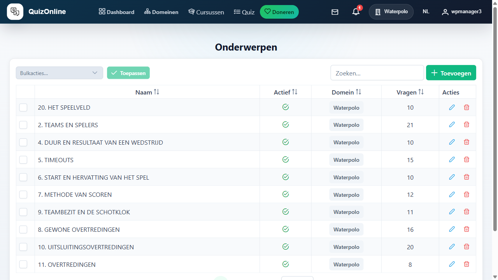

### Een onderwerp maken

Knop "+ Toevoegen" rechtsboven → `/subject/add`. Velden: **naam**, **actief** (ja/nee), **domein** (vooraf ingevuld als je er maar één beheert, anders picker).

### Bewerken of verwijderen

Potlood per rij — bewerkt naam, domein, actief-vlag. Prullenbak — verwijdert; gekoppelde vragen worden losgekoppeld, niet verwijderd.

## 12. Vragen maken en importeren

`/question/list` — de vragenbank voor elk domein dat je beheert. Filters:

- **Vrije zoekopdracht** op de titel.
- **Onderwerpen** — multi-select. Toont enkel vragen met minstens één van de geselecteerde onderwerpen.

Kolommen: titel, actief, modi (Oefening / Examen / beide), onderwerpen, acties. Bulk-acties: activeren / deactiveren / verwijderen.

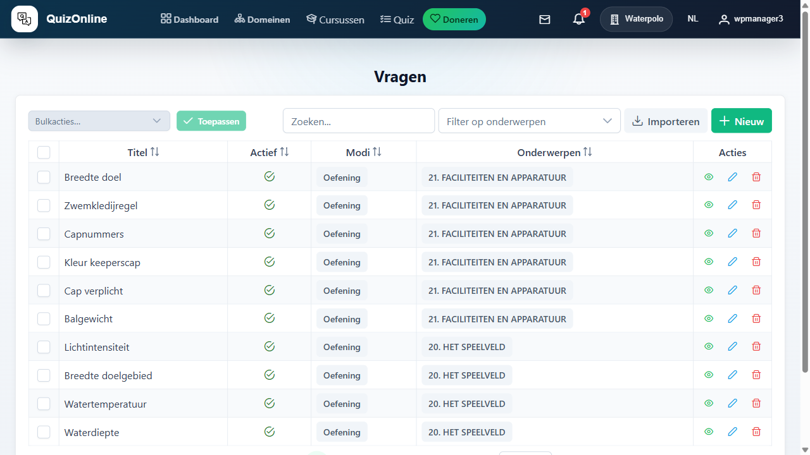

### Een vraag maken

Knop "Nieuwe vraag" bovenaan → `/question/add`. Het formulier heeft twee delen:

1. **Metadata**: actief, domein, onderwerpen (multi-select), modi (vink Oefening en/of Examen aan).
2. **Inhoud per taal**: één tab per toegestane taal van het domein. Je bewerkt de vraagstelling en dan de antwoordopties via dezelfde 8 bloktypes als een les (zie [hoofdstuk 4](#4-de-8-bloktypes)). "Vertaal vanuit deze tab" vult de lege talen.

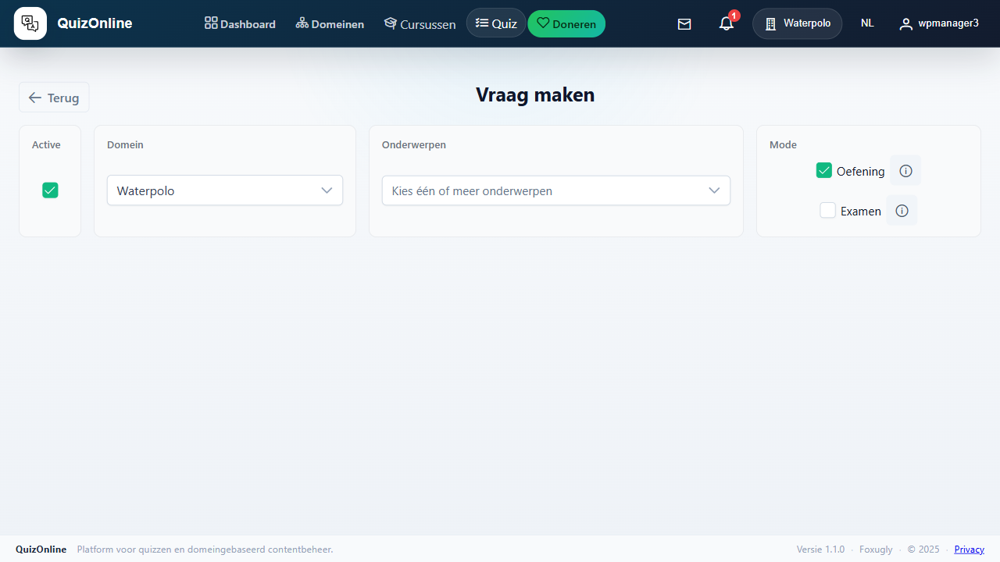

Automatisch opgeslagen tijdens het bewerken.

### Oefening vs. Examen

- **Oefening** — de vraag is bruikbaar in een quiz in oefenmodus. Feedback verschijnt direct na elk antwoord; de cursist mag opnieuw proberen.
- **Examen** — de vraag is bruikbaar in een quiz in examenmodus. De score wordt pas op het einde onthuld, en elk examensjabloon is **single-attempt** per cursist.

Een vraag mag Oefening **en** Examen aangevinkt hebben — dat is zelfs de standaard.

### Bulkimport

Knop "Importeren" naast "Nieuwe vraag" → `/question/import`. Upload een bestand om meerdere vragen in één keer aan te maken — handig om een bestaande bank te migreren.

## 13. Een quizsjabloon samenstellen

`/quiz/list` — het startpunt. Twee tabs:

- **Sjablonen** — de lijst van `QuizTemplate`s in de domeinen die je beheert. Knoppen "Samenstellen" (volledige vorm) en "Snel aanmaken" rechtsboven.
- **Mijn sessies** — je eigen `Quiz`-instanties (lopende of afgeronde sessies, ook als instructeur).

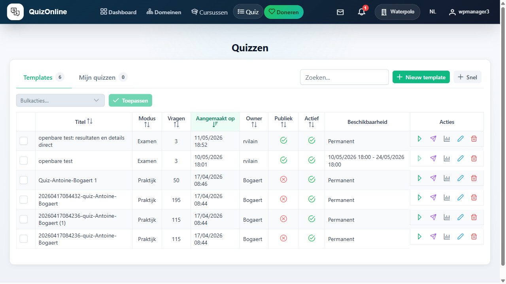

### De editor (`/quiz/add`)

Drie tabs:

#### Tab "Teksten"

Titel + beschrijving per taal (één tab per toegestane taal), met de knop "Vertaal vanuit deze tab".

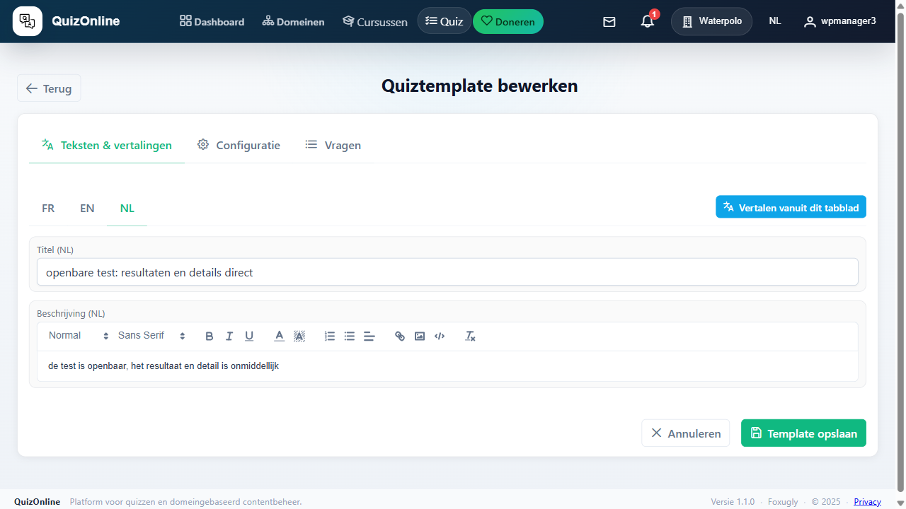

#### Tab "Configuratie"

Zes configuratiesecties:

- **Status** — Actief (bruikbaar) / Publiek (zichtbaar in de catalogus voor elke domeingebruiker; anders enkel zichtbaar voor cursisten aan wie de instructeur expliciet een sessie toewees).
- **Modus** — Oefening / Examen. **Timer**: aan/uit, duur in minuten. Bij verloop wordt de sessie automatisch ingediend.
- **Volgorde** — "Vragen schudden": anders is de volgorde die van de Vragen-tab.
- **Beschikbaarheid** — **Permanent** (altijd open) **of** een venster met "Begint op" / "Eindigt op". Buiten het venster is de quiz onzichtbaar in de catalogus.
- **Scorezichtbaarheid** — Onmiddellijk (bij indienen) / Gepland (vanaf een gekozen datum) / Nooit.
- **Detailzichtbaarheid** (vragen + juiste antwoorden) — Onmiddellijk / Gepland / Nooit. Onafhankelijk van de scorezichtbaarheid.

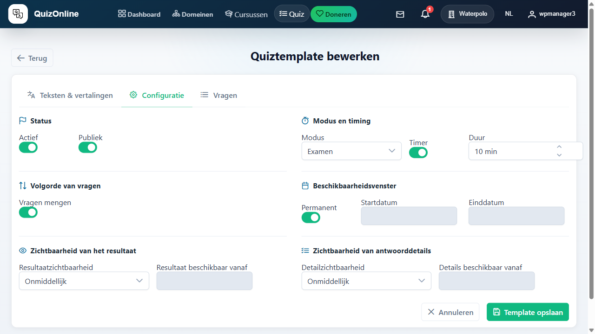

#### Tab "Vragen"

Twee kolommen:

- **Bibliotheek** (links) — vrije zoekopdracht + onderwerpfilter. "+"-knop op elke kaart om aan de compositie toe te voegen. Een "+ Aanmaken"-knop opent de vraageditor in een dialoogvenster zonder de quiz te verlaten.
- **Compositie** (rechts) — je vragen op volgorde. Op/neer-knoppen om te herschikken, kruisje om te verwijderen, gewichtveld om te wegen (de score wordt gewogen berekend).

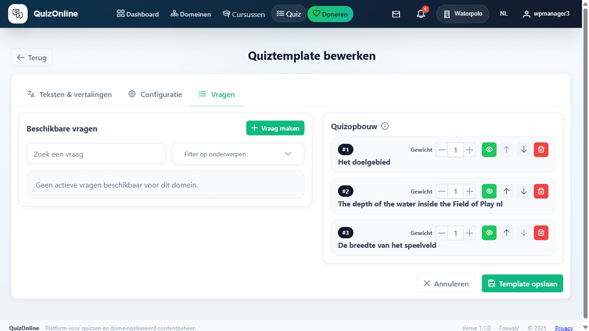

Automatisch opgeslagen met een "Opgeslagen X geleden"-indicator onderaan het formulier.

### Snel aanmaken

Voor een eenvoudige eentalige quiz opent de knop "Snel aanmaken" in `/quiz/list` `/quiz/quick`, een licht formulier: titel + vraagselectie. De quiz wordt aangemaakt met de standaardwaarden (actief, niet-publiek, oefening, geen timer, permanent).

## 14. Resultaten van een sjabloon volgen

Vanuit de sjablonenlijst in `/quiz/list` brengt de actie "Resultaten" je naar `/quiz/template/<templateId>/results`: de lijst van elke sessie (`Quiz`) gestart op dit sjabloon, door om het even welke cursist in het domein.

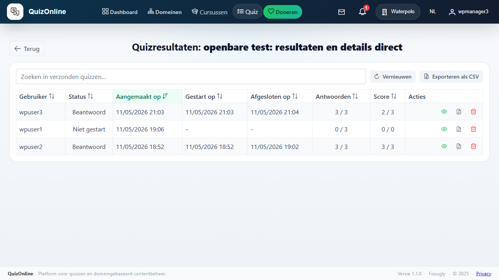

Kolommen: cursist, startdatum, einddatum, score, status. Gebruik dit om de cohorte van een quiz in een cursus op te volgen, of om een systematisch foutgemaakte vraag te ontdekken.
