# Handleiding — Cursist

Je bent lid van een domein en wilt cursussen volgen. Deze handleiding behandelt alles wat je nodig hebt, van eerste login tot certificaat.

> Terug naar [index](index.md).

## Inhoudsopgave

1. [Aanmelden en dashboard](#1-aanmelden-en-dashboard)
2. [De cursuscatalogus](#2-de-cursuscatalogus)
3. [Inschrijven voor een cursus](#3-inschrijven-voor-een-cursus)
4. [Een les volgen](#4-een-les-volgen)
5. [Een quiz afleggen](#5-een-quiz-afleggen)
6. [Mijn voortgang volgen](#6-mijn-voortgang-volgen)
7. [Mijn certificaten](#7-mijn-certificaten)
8. [Mijn uitnodigingen beheren](#8-mijn-uitnodigingen-beheren)
9. [Persoonlijke voorkeuren](#9-persoonlijke-voorkeuren)

---

## 1. Aanmelden en dashboard

### Aanmelden

Twee manieren om op het platform te komen:

- **Klassiek wachtwoord** vanaf `/login`: gebruikersnaam + wachtwoord.
- **Magic link** vanaf `/login`: vul je e-mail in en klik op "Aanmelden met magic link". Je krijgt een e-mail met een eenmalige link die enkele minuten geldig is. Handig als je je wachtwoord vergeten bent en de reset-procedure wilt vermijden.

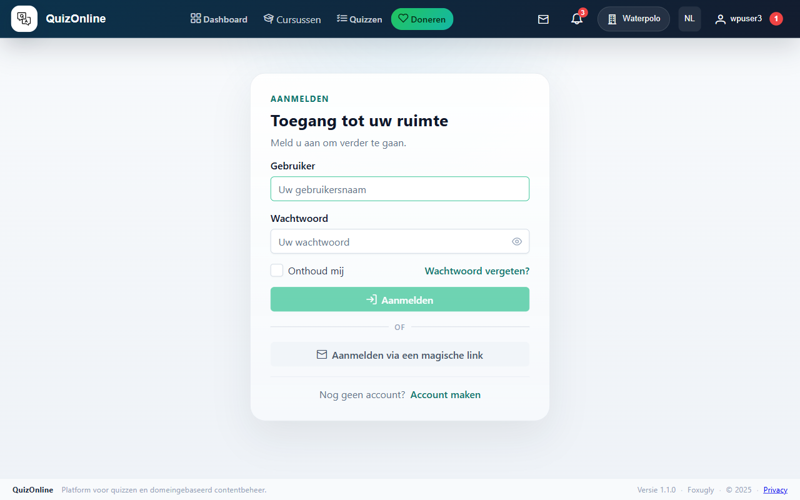

### Het dashboard

Na het aanmelden kom je terecht op `/dashboard`. Dat is je vertrekpunt en verzamelt alles wat jou aangaat in een raster van tegels:

- **Mijn lopende cursussen** — je 3 meest recent actieve cursussen met hun voortgangsbalk.
- **Mijn certificaten** — teller van behaalde certificaten + link naar de volledige lijst.
- **Mijn quizzen** — snelkoppeling naar je quizsessies.
- **Openstaande uitnodigingen** — je cursusuitnodigingen (alleen zichtbaar als je minstens één uitnodiging hebt, of als je zelf ergens instructeur bent).
- **Catalogus** — snelkoppeling naar de cursuscatalogus.

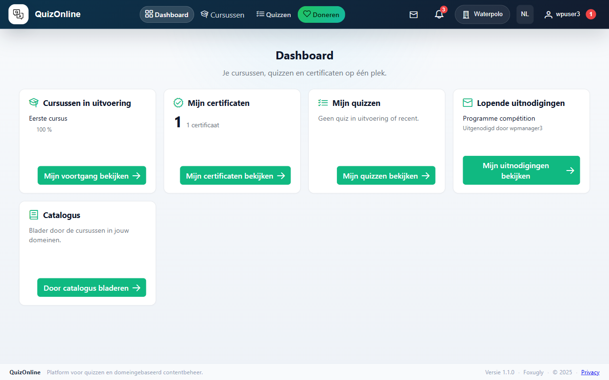

## 2. De cursuscatalogus

De catalogus (`/catalog`) toont alle **gepubliceerde** cursussen die je in jouw domeinen kunt zien.

### Filters

Drie filters bovenaan:

- **Zoeken** — vrije tekst, zoekt in titels en beschrijvingen. Vertraagd 300 ms — Enter is niet nodig.
- **Niveau** — Beginner / Gevorderd / Expert.
- **Domein** — alleen zichtbaar als je tot meerdere domeinen behoort.

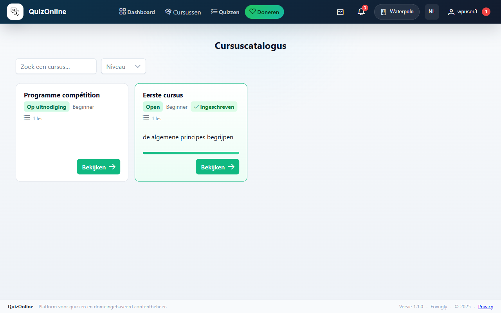

### Een cursuskaart lezen

Elke kaart toont de titel, een badge voor de inschrijfmodus (Vrij / Op goedkeuring / Op uitnodiging), het niveau, het aantal lessen, de geschatte duur en de beschrijving (afgekapt na 3 regels). Als je al ingeschreven bent, verschijnt er een groene "Ingeschreven"-badge en vervangt de voortgangsbalk een deel van de kaart.

Klik op "Bekijken" (of "Hervatten" als je al ingeschreven bent met een onafgemaakte les) om de detailpagina te openen.

### Paginering

Onder het raster laat een paginator je navigeren als je domein meer dan 20 cursussen bevat.

## 3. Inschrijven voor een cursus

De detailpagina (`/course/<slug>`) toont de titel, de beschrijving, de leerdoelen (indien ingevuld) en de boom van secties + lessen.

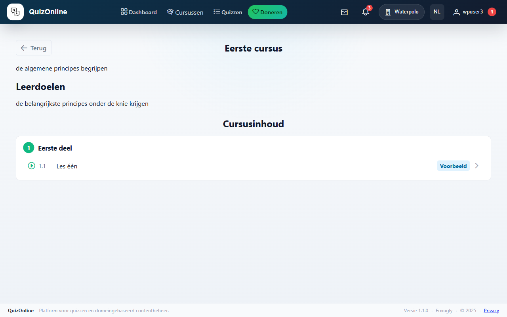

De knop rechts in de header hangt af van de inschrijfmodus van de cursus en je status:

| Modus | Niet ingeschreven | Ingeschreven |
|-------|--------------------|--------------|
| Vrij | "Inschrijven" — één klik en je bent ingeschreven. | "Hervatten" — gaat naar de volgende onafgemaakte les. |
| Op goedkeuring | "Inschrijven" — je aanvraag gaat in afwachting; een instructeur moet goedkeuren. | Idem. |
| Op uitnodiging | De cursus is verborgen tot je een uitnodiging ontvangt. Anders: "Uitnodiging aanvaarden". | Idem. |

### Inschrijven via uitnodiging

Als je een uitnodiging per e-mail ontvangen hebt:

1. Klik de link in de e-mail — je komt op `/course-invite/<token>` terecht.
2. Een aanvaardingspagina toont de cursus, wie je uitnodigde en de vervaldatum.
3. Klik op "Uitnodiging aanvaarden" om in te schrijven en deel te nemen.

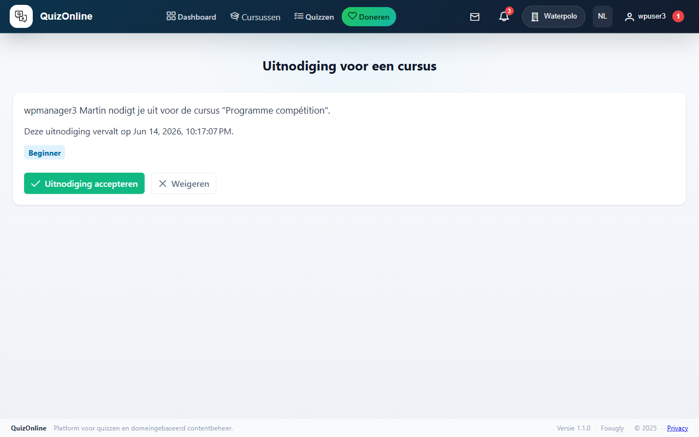

De uitnodiging vervalt automatisch 14 dagen na verzending. Je krijgt een herinnering per e-mail 3 dagen voor de vervaldatum als je nog niet aanvaard hebt.

## 4. Een les volgen

De lespagina (`/lesson/<id>`) is opgedeeld in:

- **Blok-overzicht** (links, sticky op desktop) — genummerde lijst van de inhoudsblokken van de les, met scroll-spy: het zichtbare blok is gemarkeerd in het overzicht.
- **Lesinhoud** (rechts) — de eigenlijke inhoud, één blok per kaart.
- **Privénotities** (onderaan) — een tekstveld voor persoonlijke notities, automatisch opgeslagen (vertraagd 600 ms).
- **Navigatiefooter** — knoppen "← Vorige les", "Markeer als voltooid", "Volgende les →".

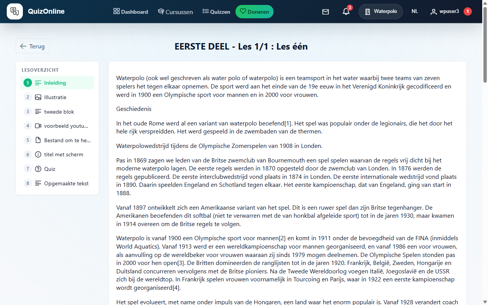

### Bloktypes

Een les kan 8 bloktypes bevatten:

- **Rijke tekst** — opgemaakte paragrafen.
- **Afbeelding** — illustraties.
- **Video** — YouTube, Vimeo of geüpload bestand.
- **Bestand** — PDF of document om te downloaden.
- **Quiz** — een ingesloten quiz (zie volgende sectie).
- **Kader** — opvallende nota of waarschuwing.
- **Code** — codefragment met syntaxiskleuring.
- **Insluiting** — externe inhoud via iframe.

### Een les als voltooid markeren

De knop "Markeer als voltooid" in het midden van de footer registreert de voltooiing. De knop "Volgende les" heeft net daarna een licht pulserend effect om je verder te leiden. De cursusvoortgang wordt automatisch bijgewerkt.

## 5. Een quiz afleggen

Als een les een quiz-blok bevat, zie je een kaart met de knop "Quiz starten". Als je de quiz al geslaagd hebt, toont de kaart je score.

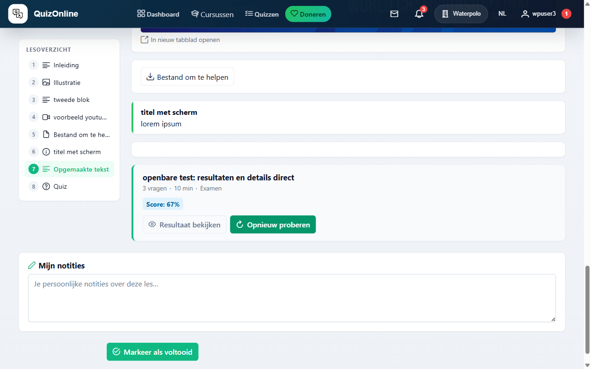

Een tweede ingang is `/quiz/list`, tab "Sjablonen": de lijst van elke publieke quiz in de domeinen waar je deel van uitmaakt, met een "Starten"-knop per kaart. De tab "Mijn sessies" toont de sessies die je al hebt aangemaakt (lopend of afgerond), om verder te gaan of de score te bekijken.

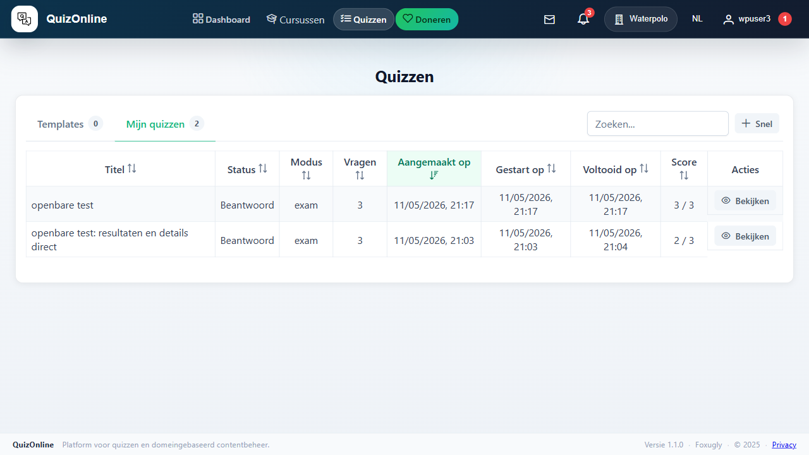

### De spelersinterface

De spelerspagina (`/quiz/<quizId>/questions`) is verdeeld in twee kolommen:

**Linker kolom**

- **Aftelklok** als de quiz een timer heeft. Op nul wordt de sessie automatisch ingediend.
- **Navigatieraster** — één knop per vraag, in een raster van 5 kolommen. Elke knop toont de status:
  - leeg — nog niet bekeken;
  - beantwoord — je hebt minstens één optie aangevinkt;
  - gemarkeerd voor herziening (vlag) — je wil terugkomen.

Klik op een nummer om direct naar die vraag te springen.

**Rechter kolom** — de huidige vraag:

- Vraagstelling (eventueel met afbeeldingen, video, code, enz. — zelfde blokpalet als een les).
- Antwoordopties om aan te vinken (radio bij één juist antwoord, checkbox bij meerdere).
- **Markeren voor herziening**-knop — schakelt de vlag aan/uit zodat je voor indienen kan terugkomen.
- **Probleem melden**-knop — stuurt een melding naar de instructeur (typfout, fout antwoord, dubbelzinnigheid). Opent een dialoog om het probleem te beschrijven.
- Knoppen **Vorige** / **Volgende** / **Beëindigen** (Beëindigen verschijnt op de laatste vraag).

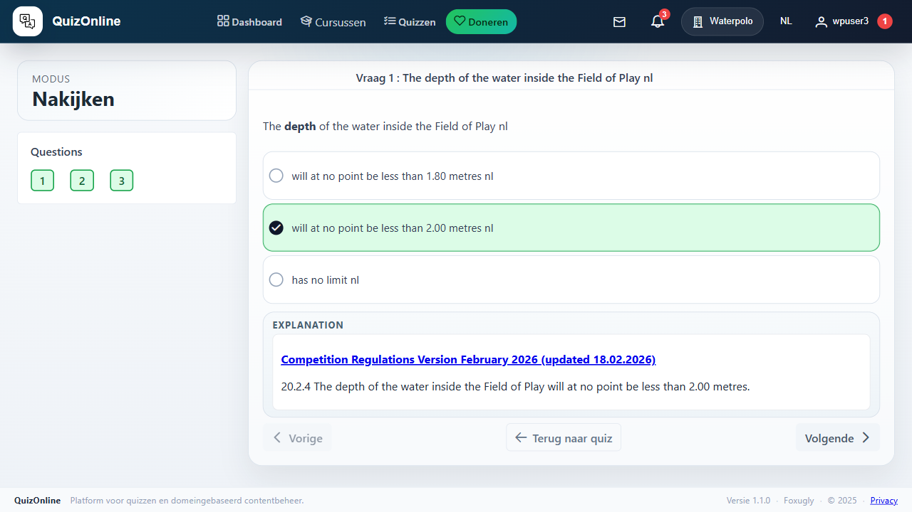

### Oefening vs. Examen

- **Oefening** — de correctie verschijnt direct na elke "Volgende". Je ziet je fouten en kan opnieuw proberen op een nieuwe sessie.
- **Examen** — geen correctie tot je beëindigt. **Single-attempt**: zodra de sessie gestart is, kan je geen nieuwe meer aanmaken op hetzelfde sjabloon (tenzij de instructeur je sessie verwijdert).

### Indienen en de score bekijken

"Beëindigen"-knop op de laatste vraag (bevestiging vereist). Je komt op `/quiz/<quizId>` terecht, het sessie-overzicht: datum, duur, score, geslaagd/niet-geslaagd.

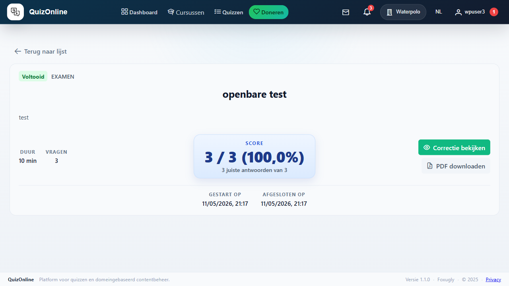

- Als de **scorezichtbaarheid** onmiddellijk is, verschijnt de score hier. Als ze gepland is, zie je tot die datum een bericht "Beschikbaar vanaf…".
- Als de **detailzichtbaarheid** het toelaat, opent een "Vragen herzien"-knop het raster alleen-lezen met jouw antwoorden en de juiste.

Een quiz halen met een score ≥ de drempel die de instructeur ingesteld heeft, markeert automatisch de les (of de cursus, voor een eindquiz) als voltooid.

## 6. Mijn voortgang volgen

`/me/progress` toont al je actieve inschrijvingen met hun voortgangsbalk. Klik een cursus aan om verder te gaan.

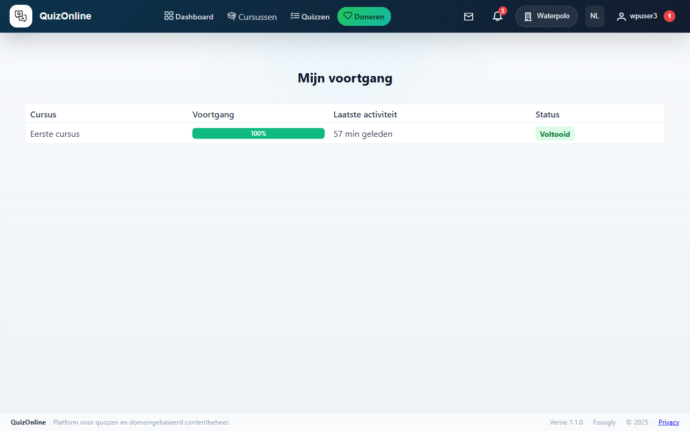

## 7. Mijn certificaten

`/me/certificates` toont de certificaten die je behaald hebt. Elk certificaat toont de cursustitel, de uitgiftedatum, het certificaatnummer en een knop "PDF downloaden".

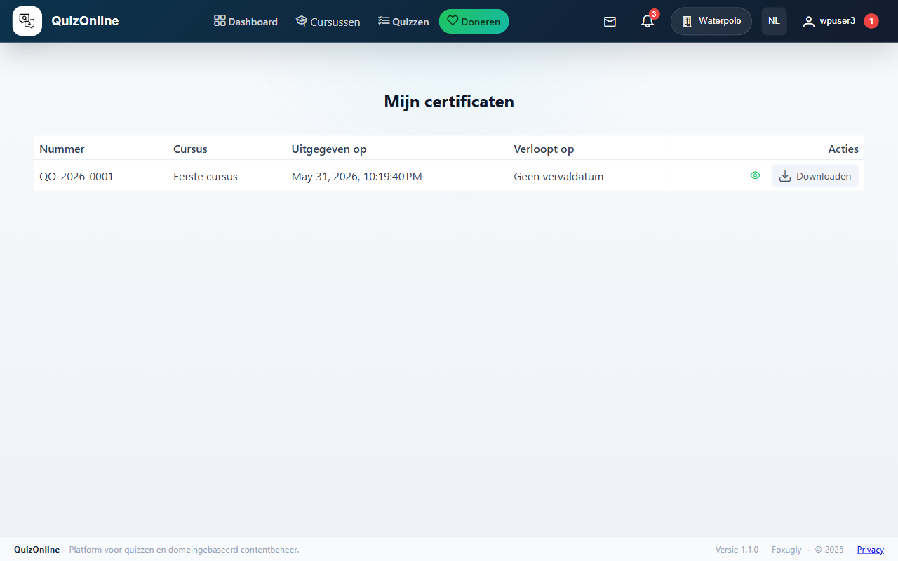

### De echtheid van een certificaat verifiëren

Elk certificaat draagt een **openbare verificatiesleutel** in de vorm `https://quizonline.foxugly.com/verify/<token>`. Iedereen (ook niet-aangemelde) kan deze URL openen en bevestigen dat het certificaat authentiek is, wie het behaalde en wanneer. Handig om te delen op een CV of LinkedIn.

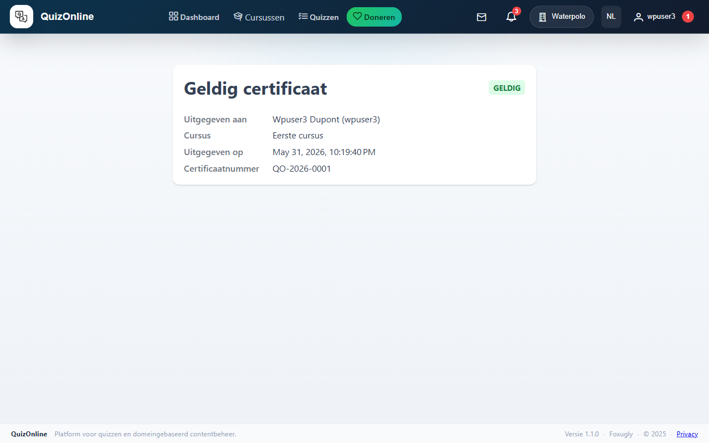

## 8. Mijn uitnodigingen beheren

`/me/invitations` toont al je cursusuitnodigingen, ingedeeld in twee tabs:

- **Lopend** — uitnodigingen nog niet aanvaard (en niet vervallen). Knop "Aanvaarden" of "Weigeren" per rij.
- **Geschiedenis** — al de rest (aanvaard, geweigerd, ingetrokken, vervallen). Indien aanvaard, laat een knop "Naar de cursus" je teruggaan.

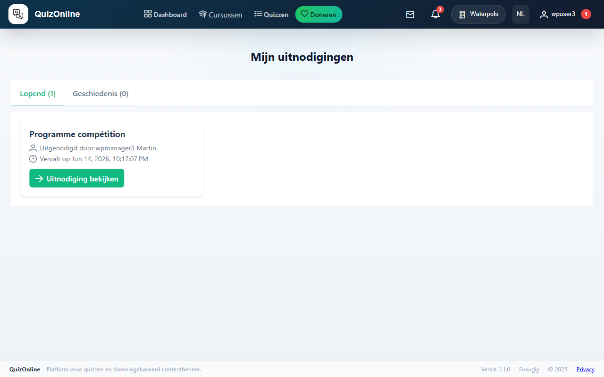

## 9. Persoonlijke voorkeuren

`/preferences` (via het gebruikersmenu rechtsboven): wijzig je naam, e-mail, wachtwoord en interfacetaal (FR / EN / NL / IT / ES).

### Meldingsvoorkeuren

Voor elk type gebeurtenis (uitnodiging ontvangen, inschrijving goedgekeurd, certificaat uitgegeven, enz.) kun je onafhankelijk uitschakelen:

- E-mail (handig als je alles in de app leest).
- Web-melding (de bel rechtsboven).

Voorkeuren zijn per-domein EN per-gebruiker — een melding wordt alleen verzonden als BEIDE het toelaten. Als je dus de bel voor uitnodigingen uitschakelt, krijg je er geen meer, ongeacht wat het domein doet.

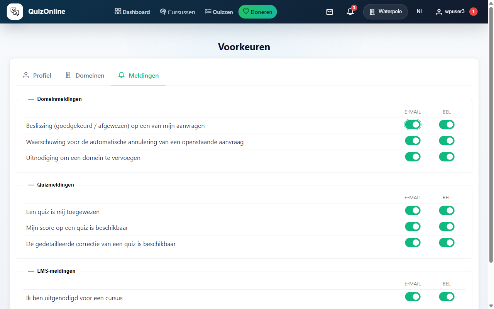
